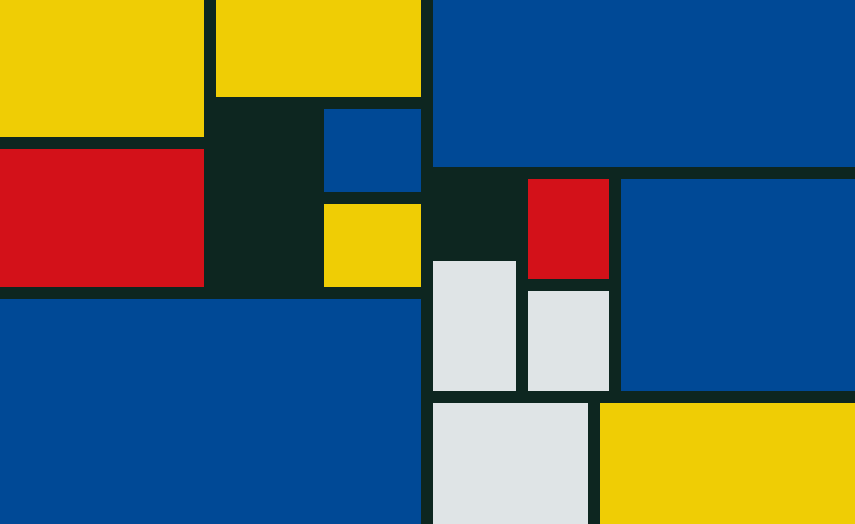

[articles](articles), [bookmarks](bookmarks), [chess](chess) **new**, [comics](comics), [demos](demos), [gallery](gallery), My [Godot Engine Assets](https://godotengine.org/asset-library/asset?- category=&godot_version=&sort=updated&filter=boukew99), [handheld](handheld), Games on [itch.io](https://howyoudoing.itch.io/), [portfolio](portfolio) with a selection of projects, [game review](review), [text adventure](text_adventure), [tiledraw](tiledraw), twitter for updates

--- 

*Art piece I made in the style of Piet Mondriaan with [Mondriaan Maker](https://itch.io/embed-upload/6017377?color=fac901)* 

