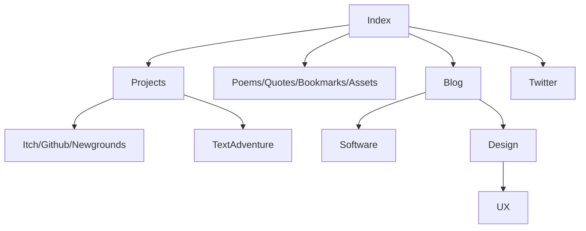

# Website
Website using [Markdown](https://docs.github.com/en/get-started/writing-on-github/getting-started-with-writing-and-formatting-on-github/about-writing-and-formatting-on-github) and [Github Pages](https://docs.github.com/en/pages).

 

## Navigation Flowchart

## Markdown Components
Templates usable throughout the website. Just copy, paste and edit them.

### Navigation bar
```
[link1]() | [link2]() | [link3]()
```
Typically on the top or bottom to act as a recognizable escape point.


### Tree structure
```
# Title
description


## 1
### 1.1
```
