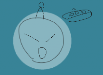

body {
  background-color: lightblue; /* For browsers that do not support gradients */
  background-image: linear-gradient(orange, lightblue);
  background-repeat: no-repeat
}

# [Bouke Projects](https://boukew99.github.io/)
Hey! I make multimodal software with inclusivity and accessibility in mind.

## [Portfolio](portfolio/)
These include software, games and a mix of those two.

## [Webcomics](comic/)
Quick fun stories in comic format.
## [FAQ](faq/)

## [Resources](resource/)
## [Music](music/)

## [Bookmarks](bookmark/index.html)
[twitter](https://twitter.com/home)
[mail](https://mail.google.com/mail/u/0/?hl=nl#inbox)
[mail2](https://outlook.live.com/mail/0/inbox)
[reddit](https://www.reddit.com/)
[itch.io](https://howyoudoing.itch.io/)
[gotm](https://gotm.io)
[github](https://github.com/)
[spotify](https://open.spotify.com/)
[netflix](https://www.netflix.com/)
[youtube](https://www.youtube.com/)
<a href="">twitter</a>

kindly and freely hosted <a href="https://github.com/boukew99/boukew99.github.io">@github</a>
