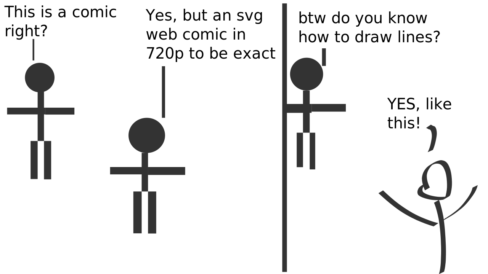

## Articles

- [Linux on USB](linux_on_usb). Trying out the linux operating system besides Windows and how to do it.
- [definitions](definitions.md). Database of alternative definitions.
- [Make a Markdown site like this](make_md_site.md). Noting down the process of making my website. 
- [physics](physics.md). ...
- [poems](poems.md). Database of written poems.
- [quotes](quotes.md). Database of resonant quotes.
- [tips](tips.md). "General" purpose.
- [Aesthetic QR codes](aesthetic_qr). Experiment.
- [Godot Editor Tutorial](godot_editor)

## Pages
- [text adventure](text_adventure) 
- [calender](calender.md)
- [bookmarks](bookmarks.md)
- [tips](tips)
- [shadertoy](shadertoy)
- [dialogues](dialogues)
- [energy usage](energy_usage)
- [math](math)
= [playlist](playlist)
- [recipes](recipes)

## Webcomics
Capturing things only [comics](comics) can.

## Let's Play
- [Teardown Screenshots](teardown). Playthrough screenshots.
- [No Mans Sky](no_mans_sky). Playthrough screenshots.

## Dev Log  
- Mondriaan Maker version 2 with infinite rectangles. [Demo](https://itch.io/embed-upload/6017377?color=fac901) [video](https://youtube.com/shorts/NXs121C7QTE)

[more...](log.md)

## About 
Landing page of my personal site on the web for all my projects, news and collection of links to other sites.
- [portfolio](portfolio), [video games](portfolio/portfolio.md#video-games)
- [FAQ](faq.md)

[^1]: 

