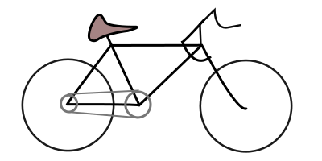

# Welcome!  

## Index
[bookmarks](bookmarks), [comics](comics), [demos](demos) [gallery](gallery), [portfolio](portfolio), [road bike](roadbike), [text adventure](text_adventure)

- Games published on [itch.io](https://howyoudoing.itch.io/).
- [Godot Engine Assets](https://godotengine.org/asset-library/asset?- category=&godot_version=&sort=updated&filter=boukew99).
- On twitter I post updates.

## FAQ / About

What is your function?
: UX design / Engineer

What technologies do you use?
: HTMl, CSS, JS for small projects and Godot Engine for bigger projects.

## New
- HTML: [Chess](chess)
- Article: Added first blog article about [putting linux on USB](blog/linux_on_usb.md)

## Articles
- [Linux on USB](linux_on_usb) 20-05-22. Trying out the linux operating system besides Windows and how to do it.
- [this](this.md). Noting down the process of making my website. 
- [Aesthetic QR codes](aesthetic_qr). Experiment.

## Playthrough Screenshots
- [Teardown Screenshots](teardown).
- [No Mans Sky](no_mans_sky).

Thanks for checkin' out my site 😊️. You can view the [source](https://github.com/boukew99/boukew99.github.io) here.
