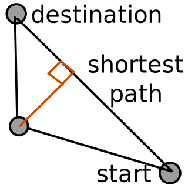

# Recursive pathfinding

This is one iteration of finding the shortest path to a destination with no direct connection, which would be the shortest path. This showcases a path through another node seperating the route into 2, though still being completely connected. This node is chosen, because it has the shortest perpendicular distance to the shortest path. Now you can apply the same operation onto these two paths to get an potentialy even shorter path by increasing level of detail. This can be iterated until satisfied by the performance measured by `new_path / shortest_path` or by reaching a maximal level of detail. This can optionally be extended by adding weights to each path to simulate path friction.
 
