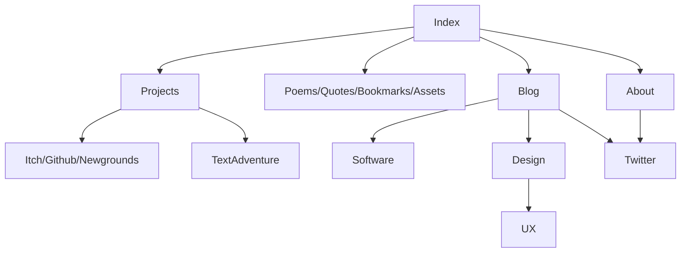

# Website
[Website](https://boukew99.github.io/) using [Markdown](https://docs.github.com/en/get-started/writing-on-github/getting-started-with-writing-and-formatting-on-github/about-writing-and-formatting-on-github) and [Github Pages](https://docs.github.com/en/pages) by [boukew99](https://github.com/boukew99). 

  

https://www.markdownguide.org/cheat-sheet/ -> https://emojipedia.org/

## Navigation Flowchart

## Markdown Components
Templates usable throughout the website. Just copy, paste and edit them.

### Navigation bar
```
[link1]() | [link2]() | [link3]()
```
Typically on the top or bottom to act as a recognizable escape point.


### Tree structure
```
# Title
description


## 1
### 1.1
```

https://www.favicon.cc/


### Elements
[](https://www.youtube.com/watch?v=iik25wqIuFo)]
```gdscript

var lol = "nice"

func _ready:
	pass
```

