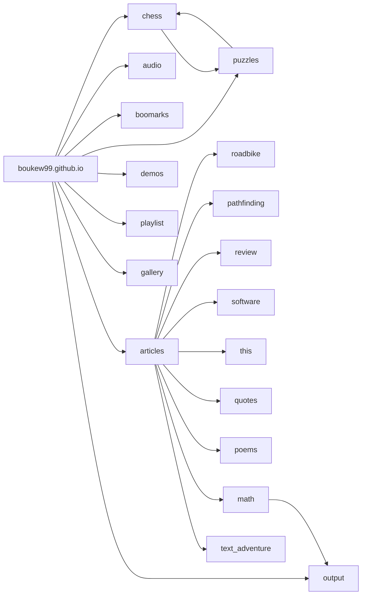

# Website Design

Max. 1GB


## Interaction
First of is navigation. This will simply be solved by scrolling. Though not all content needs to be always loaded thus scrolling is combined with links, which indicate what you want load, which will take you to that page. These rules set up the constraints for page design. First every loaded element is visibile otherwise it cannot be accesed by scrolling. Though you don't want to do too much scrolling so organize the page with care. Second, divide you website into functional pages, so the user has to do minimal loading and can acces the page independently (from anywhere). Try to provide a header (with #header) link too for an external links too provide extra context.

Then once we need a form for user input, then just use the provided `<input>` HTML, which needs differnt interaction depending on input type.


## Anchor Map


### Site Index / Folder structure
- bookmarks
- comics
- gallery
- portfolio
- roadbike
- shadertoy
- tiledraw
	- tool
	- tilemap.png
	
## Markdown Patterns
Combinations of characters with variable content that serve a some function.

### Navigation bar
```
[link1]() | [link2]() | [link3]()
```
Typically on the top or bottom to act as a recognizable escape point.


### Tree structure
```
# Title
description


## 1
### 1.1
```

https://www.favicon.cc/


### Elements
[](https://www.youtube.com/watch?v=iik25wqIuFo)]

```gdscript

var lol = "nice"

func _ready:
	pass
```

[markdown source](make_md_site.md)

### Code Transparency
Every webpage has to send its code to be rendered, so everything you see is code that is send. This you can `Inspect` by pressing f12 in the browser (or in the context menu).

<https://en.wikipedia.org/wiki/Breadcrumb_navigation>
[x]() / [y]() / [z]()

<https://www.w3schools.com/cssref/css3_pr_filter.asp>
img {
  border-radius: 50%;
}

### Thumbnail
[](img)

### filter
[category1]() | [category2]() | [category3]() | [category4]()
or with *tags*


### wiki
<a href=wiki.md download>md download</a>
[wiki download](wiki.md)
<a href=wiki download>html download</a>

#### Name

 --- | ---
[Developer](https://en.wikipedia.org/wiki/Video_game_developer) | XXX
[Programmer](https://en.wikipedia.org/wiki/Video_game_programmer) | XXX
[Platform](https://en.wikipedia.org/wiki/Computing_platform) | [Windows](https://en.wikipedia.org/wiki/Microsoft_Windows)
[Genre](https://en.wikipedia.org/wiki/Video_game_genre) | [Platform](https://en.wikipedia.org/wiki/Platform_game)


<https://uxmag.com/articles/native-or-web-based-selecting-the-right-approach-for-your-mobile-app>

<https://goose.game/>

<https://www.littleworkshop.fr/>
<https://nova.app/>
<https://panic.com/>


### Mandatory Markdown [Reference](https://commonmark.org/help/))/CheatSheet

Take a peek [behind the curtains](https://github.com/boukew99/boukew99.github.io/blob/main/articles/website.md?plain=1) of this document. Then there is also the option to `inspect(f12)` the HTML of the page.
https://www.markdownguide.org/cheat-sheet/

result | code
---|---
header | `#(#####) header`
*italic* | `*italic*` / `_italic_`
**bold** | `**bold**` / `__bold__`
~~strikethrough~~ | `~~strikethrough~~`
[link]() | `[link](src)`
 | ``
`inlince code` | \`inline code\`

>`>`Blockquote

--- 
`---` Horizontal rule

1. index
2. index2
3. index3
```
1. index
2. index2
3. index3
```


- list
- list2
- list3
```
- list
- list2
- list3
```


```
code block
```

\```
code block
\```


### Table

|Name/Order Naming | A | B | C | ... | Categories |
|---               |---|---|---|---  |---         |
|1 | | | | | | |
|2 | | | | | | |
|3 | | | | | | |


### File properties
Created: wo 29 jun 2022
Modified: wo 29 jun 2022
Size: 4,2 kB

link to header with #abcd


## Recursive list
Combining accesibility of list with the structure of a tree. Without navigating the tree.

## Tag words & structural words
News is a tag
Log is a structure

## Emoticons
📰 📅 🥦 🔖 🔗 🆕 🗣️🖱️🎲🎮ℹ️🔊🔉🔈🔇🎵(^-^*) ^^
`Ctrl+;` or https://emojipedia.org/

## Patterns
Open in [Github](https://github.com/boukew99/boukew99.github.io/blob/main/make_md_site.md) to get a copy button.

### HTMl Table three columns
Minimal Table size for reocurring properties.

<!-- https://github.com/github/linguist/blob/master/lib/linguist/languages.yml -->
```html
<table>
	<caption>...</caption>
	<tr>
  	<th>Instances</th>
    <th>property B</th>
    <th>property C</th>
  </tr>
  <tr>
    <td>Instance 1</td>
    <td>1</td>
    <td>2</td>
  </tr>
  <tr>
    <td>Instance 2</td>
    <td>2</td>
    <td>1</td>
  </tr>
</table>
```

<div width=200 style="background: rgb(2,0,36); background: linear-gradient(30deg, rgba(2,0,36,1) 0%, rgba(9,9,121,1) 16%, rgba(238,68,220,1) 32%, rgba(226,48,48,1) 46%, rgba(255,183,47,1) 63%, rgba(230,227,22,1) 77%, rgba(18,164,10,1) 87%, rgba(2,0,36,1) 100%);" 
</div>

<a name="OSS"></a> [Open Source Software](#OSS)

## Skill progress
 <label for="presenting">Presenting:</label>
<progress id="presenting" value="32" max="100"> 32% </progress> 


## Input Table
For dynamic color palletes at [Shadertoy](https://www.shadertoy.com/view/ll2GD3), using
$color(t) a + b * \cos{2n(c*t+d)}$.

| pallete | a | b | c | d |
|---      |---|---|---|---|
| rainbow | 0.5, 0.5, 0.5 |	0.5, 0.5, 0.5	| 1.0, 1.0, 1.0	| 0.00, 0.33, 0.67 |
| cliff waters | 0.5, 0.5, 0.5	|	0.5, 0.5, 0.5	| 1.0, 1.0, 1.0 |	0.00, 0.10, 0.20 |

<https://www.tablesgenerator.com/markdown_tables>

#### Table of Contents / Contents

- [Underline](#underline)
- [Indent](#indent)
- [Center](#center)
- [Color](#color)

+ < back

To | [Godot Assets 💻](#godot-assets) | [Video Games 🎮](#video-games) | [Skill Table ⭐](#skill-table) 


*caption*

    About Me (Us) – This page should include a biographical summary of the author(s) as well as a mission statement. Think about the answers to these questions: How did your passion for the subject matter develop? What do you want to convey to the world? What is your ultimate goal?
    Contact Me (Us) – A contact page provides the visitor a place to reach the author which, in turn, provides the visitor with the reassurance that you are a real and reachable author. You can add your physical address, phone number, and custom email address. Or you can utilize a simple contact form to keep your personal identifying information private. You should put links to all of your social media profiles here as well.
    
#### Search link
Knowing the name of a object. Know you can call and talk about it and thus search it. It is an acces point.

https://www.google.com/search?q=Google+tutorial+create+link
https://duckduckgo.com/?t=ffab&q=DuckDuckGo+tutorial+create+link&ia=web

#### Index
https://en.wikipedia.org/wiki/Index_(publishing)

#### Dictionary
[dictionary](https://en.wiktionary.org/wiki/dictionary)
<https://en.wikipedia.org/wiki/Wiktionary>

### Referencing
[^1] 
[^1]:ref

### Zipping or Tarring site
- https://github.com/boukew99/boukew99.github.io/zipball/master (.zip)
- https://github.com/boukew99/boukew99.github.io/tarball/master (.tar.gz)
- https://github.com/boukew99/boukew99.github.io (github)

<https://github.com/ramnathv/slidify/issues/410>
<https://stackoverflow.com/questions/10540935/what-is-the-difference-between-tar-and-zip>

Zip a folder manually for local usage or use `Save Page as` yourself.

loc
<https://linuxconfig.org/counting-lines-of-code-with-cloc>
or
https://www.geeksforgeeks.org/wc-command-linux-examples/
or https://stackoverflow.com/questions/1358540/how-can-i-count-all-the-lines-of-code-in-a-directory-recursively
# Frequently Asked Questions (FAQ)

**What is FAQ?**
Frequently Asked Question, though often they are just made up.

What is FAQ?
: Frequently Asked Question, though often they are just made up.

## Process Flow 
Also known as workflow.

## Contact
📫 [mail someone](mailto:someone@world.com)

## LITE pages
minimal, so fast load times

## Optimize
https://web.dev/fast/#optimize-your-images

## Steps
Like handcrafted steps recorder. Divide in steps with accompanying full context screenshot with enrectangled area of interaction.

## Internal links
Strengthens network and by keeping them non-reptitive, you can increase perceived depth.


If you want you can leave an [issue](https://github.com/boukew99/boukew99.github.io/issues), though I will probably fix it regardless. 


