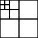
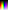
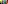

## Assets 📦

- [sfx's pack](sound.zip) for some general sounds signaling a action. [(preview)](sounds.ogg)
- [Bookxel](bookxel.ttf), a very readable pixel font. [godot setup](bookxel_godot.zip)
- [icons](icon.zip) (16x16 1-bit) representing common functions. [(preview)](icons.png)
- alpha [circle](alpha_circle.png) [pyramid](alpha_pyramid.png)
- 

### Palletes
- 
- 
- 
- <https://lospec.com/palette-list/pico-8>
- <https://ewenme.github.io/ghibli/>
- <http://designmadeinjapan.com/magazine/graphic-design/the-rich-colors-of-studio-ghibli/>

<svg><rect width="32" height="32" rx="20" ry="20" style="fill:#ff0000"/></svg>|<svg><rect width="32" height="32" rx="20" ry="20" style="fill:#00ff00"/></svg> |<svg><rect width="32" height="32" rx="20" ry="20" style="fill:#0000ff"/></svg>
red | green | blue
ff0000 | 00ff00 | 0000ff

<https://www.w3schools.com/colors/colors_picker.asp>
### External

- [FreePats project](https://freepats.zenvoid.org/index.html) sound bank of unique instruments.
- [Philharmonia sound samples](https://philharmonia.co.uk/resources/sound-samples/) It includes all standard orchestral instruments, as well as guitar, mandolin, banjo, and a vast array of different percussion instruments.

### Gradients

