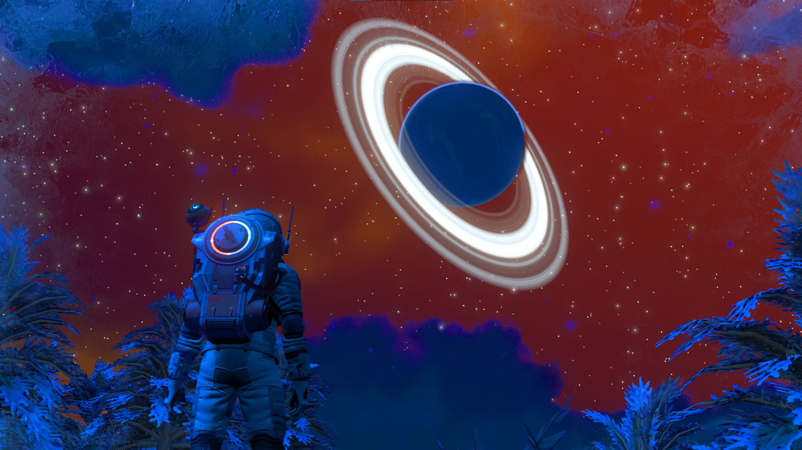
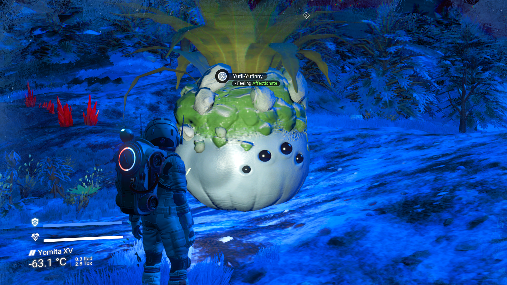
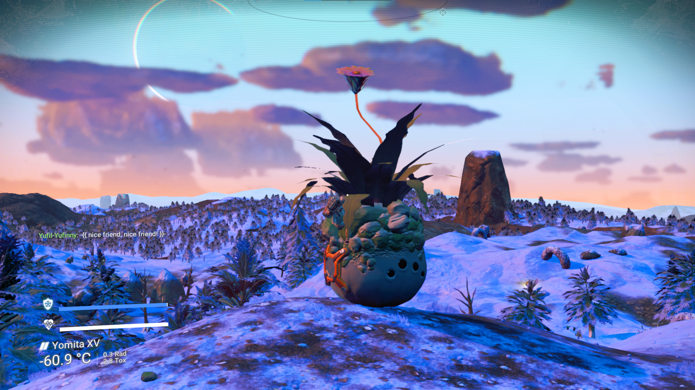
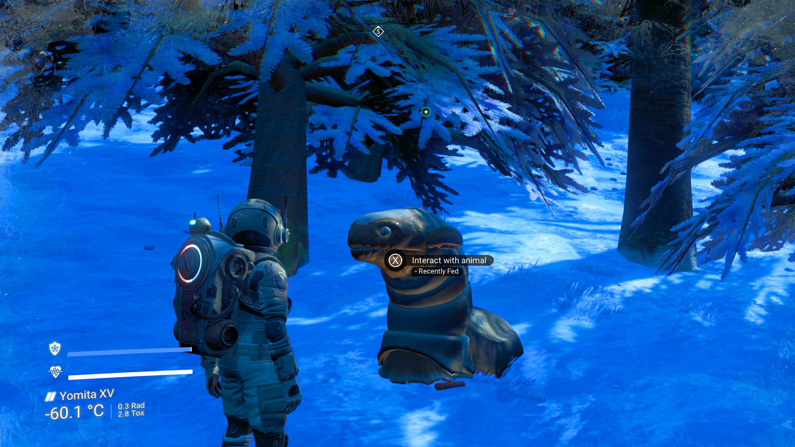

# No Mans Sky

So I got intersted in the procedural art of No Mans Sky and decided to give it a try. I did not try the crafting gameplay for long and switched to creative mode and got in the ship to explore this generated universe. 

I landed on this artic planet with a nice view of a ringed planet in the sky and then came across some procedural *plant slime animal*. Turns out you can ride it and so I went hopping around on that thing. I also came across the upper part of snake that was walking upright, but without feet.

Then I had seen enough and went of to the ringed planet with a speed 78,012 u/s otherwise I would travelling for 6 hours or real time.

On the way I also used the camera mode to take some screenshots from the ship and its surroundings. Interestingly you could also control the sun, of which there was still only one. I used that to make an eclpise.

