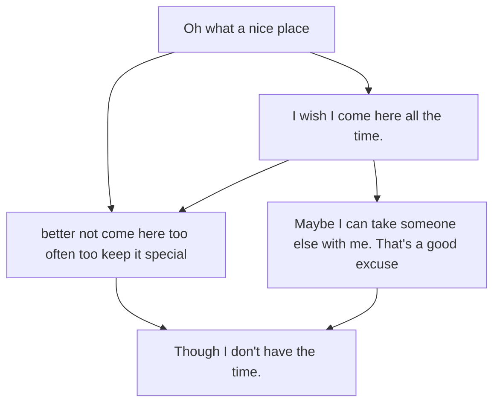

# Dialogues

Fictional dialogues between fictional characters. Planned to parse for dialogue.

## Passerbys

1
: Oops, sorry I was not paying attention there.

2
: Wow you had quite some force with that collision.

1
: Yeah I have to be somewhere soon, here let me help you up.

2
: Thank you, but next time please just watch out and keep your phone in the pocket maybe?

1
: Ah that makes sense, though the pockets in these pants are only for decoration.

2
: Uhh what that does not make any sense, I mean what year are we living?!

1
: Yeah idk fashion I guess. 

2
: There are soo many pocket items! Pocket phones, pocket keys, pocket food, pocket...

1
: Yes I get it! Don't judge my poor sense for utility, I too was deveceived by the fake pockets.

2
: ...

1
: Okay have to go now! 

## Developer Notes

player
: lalala, I am just walking throughout this game world.
: Oh what is this? A note lying around in this random place? *picks it up*

Note
: Thanks for reading this!

player
: What was that about? *slightly confused*
: I dunno. Lalala. *keeps on walking*

## Choice

What do I choose now?
: [Apples]
: [Potatoes]
: [Strawberry]

## Dict

{player:"lalala, I am just walking throughout this game world.",

player: "Oh what is this? A note lying around in this random place? *picks it up",

Note: "Thanks for reading this! ",

player: "What was that about? *slightly confused*'',

player: "I dunno. Lalala. *keeps on walking"}

## diagram

