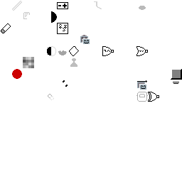

# Index

## Projects

### [Itch.io](https://howyoudoing.itch.io/)
1. [Scratch Animator](https://howyoudoing.itch.io/scratch-animator)
2. [Mondriaan Maker (3 by 3)](https://howyoudoing.itch.io/mondriaan-maker)

### [Github](https://github.com/boukew99)
1. [joypad lab](https://github.com/boukew99/joypad_lab)
2. [scratch canvas](https://github.com/boukew99/scratch_canvas)
3. [calculator GUI](https://github.com/boukew99/gui_calculator)
4. [mic recorder](https://github.com/boukew99/mic_recorder)
5. [text chess](https://github.com/boukew99/text_chess)
6. [screen capturer](https://github.com/boukew99/screen_capture)
7. [shader window](https://github.com/boukew99/shader_window)
8. [audio station](https://github.com/boukew99/audio_station)

## Pages
* [Bookmark](bookmark.md)
* [Definitions](definitions.md)

### [Icons](icon_pack/)

### [Sound](sound_pack/)
[pack](sound_pack/pack.ogg)

## Footer
Markdown website hosted at [Github](https://github.com/boukew99/boukew99.github.io)
