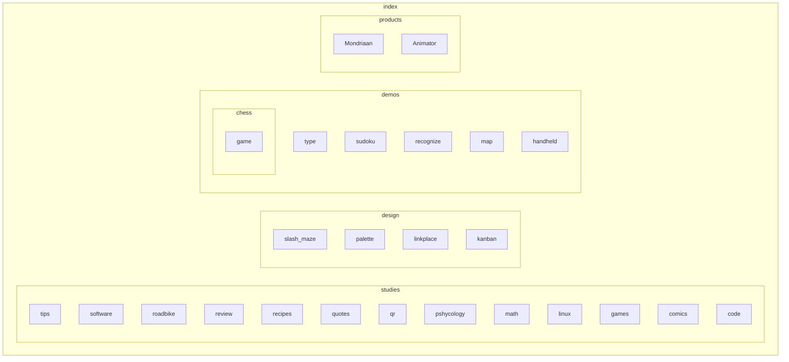
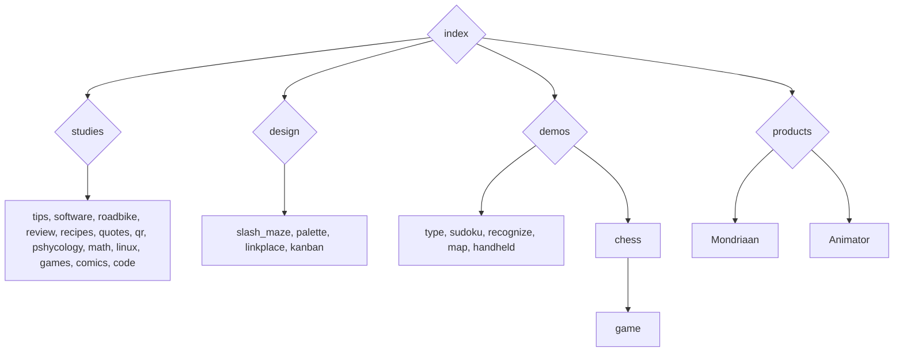

# Design

## Site Diagram

## Common elements

familair home favicon

## Page structure

1 dimensional text with column-width. Next links at end.

## Content

- files
  
  - programms
    - demos
    - tools
  - studies
    - infographics
  - process (later)

- external
  
  - connect
  - combo-ing others

## Linking

Hierarchical advancing (`Go back` for undo)

## Overview & Zooming

When a user enters your site they should get an overview of the page. Minimize scrolling, to minimize overview time. Then the user can decide where to **zoom** for more information. Zooming can be done by loading a new page, as happens on the web when you click a hyperlink, or it could be a smooth zoom, such as on digital maps, which dynamically load in more details as you zoom in, to give you a new overview. Preferably you only want to zoom in, since zooming out means you did not find what you looked for. 

## Interaction

Divide you website into functional pages, so the user has to do minimal loading and can acces the page independently (from anywhere). Try to provide a header (with #header) link too for an external links too provide extra context. Then once we need a form for user input, then just use the provided `<input>` HTML, which needs differnt interaction depending on input type. Downward/sideway file flow only. 

## Source Transparency

The source is fully transparent, since only HTML & CSS & JS is used. This you can inspect(F12).

## Documentation

- <https://developer.mozilla.org/en-US/docs/Web/API>, relevant context of source.
- <https://developer.mozilla.org/en-US/docs/Learn>
- <https://www.w3schools.com/colors/colors_names.asp>

## Tools

- <https://www.favicon.cc/>
- <http://www.image-map.net/>
- <https://beautifytools.com/javascript-validator.php>
- <https://validator.w3.org/#validate_by_uri+with_options>
- https://cssgradient.io/gradient-backgrounds/?

<https://en.wikipedia.org/wiki/Breadcrumb_navigation>
[x]() / [y]() / [z]()
History navigation feedback, with preview of data to be sent
https://addons.mozilla.org/en-US/firefox/addon/breadcrumbus/

### wiki

wiki means fast in hawai.

#### Name

<table class="table table-striped table-bordered">
<thead>
<tr>
<th></th>
<th>Name</th>
</tr>
</thead>
<tbody>
<tr>
<td><a href="https://en.wikipedia.org/wiki/Video_game_developer">Developer</a></td>
<td>XXX</td>
</tr>
<tr>
<td><a href="https://en.wikipedia.org/wiki/Video_game_programmer">Programmer</a></td>
<td>XXX</td>
</tr>
<tr>
<td><a href="https://en.wikipedia.org/wiki/Computing_platform">Platform</a></td>
<td><a href="https://en.wikipedia.org/wiki/Microsoft_Windows">Windows</a></td>
</tr>
<tr>
<td><a href="https://en.wikipedia.org/wiki/Video_game_genre">Genre</a></td>
<td><a href="https://en.wikipedia.org/wiki/Platform_game">Platform</a></td>
</tr>
</tbody>
</table>

<https://uxmag.com/articles/native-or-web-based-selecting-the-right-approach-for-your-mobile-app>

#### Search link

Knowing the name of a object. Know you can call and talk about it and thus search it. It is an acces point.

https://www.google.com/search?q=Google+tutorial+create+link
https://duckduckgo.com/?t=ffab&q=DuckDuckGo+tutorial+create+link&ia=web

#### Dictionary

[dictionary](https://en.wiktionary.org/wiki/dictionary)
<https://en.wikipedia.org/wiki/Wiktionary>

loc
<https://linuxconfig.org/counting-lines-of-code-with-cloc>
or
https://www.geeksforgeeks.org/wc-command-linux-examples/
or https://stackoverflow.com/questions/1358540/how-can-i-count-all-the-lines-of-code-in-a-directory-recursively

## Optimize

https://web.dev/fast/#optimize-your-images

## Guide

https://edu.gcfglobal.org/en/internetbasics/what-can-you-do-online/1/

## Gradient scroll

body {
  height: 3000px;
  background: linear-gradient(141deg, #0fb8ad 0%, #1fc8db 51%, #2cb5e8 75%);
}

## 1D game

- scroll + wait
- gradient bg
- position:fixed

## Procedural map

volcano map: z= (1 + sin(x)+cos(y))^2

## OpenMap

<iframe width="425" height="350" frameborder="0" scrolling="no" marginheight="0" marginwidth="0" src="https://www.openstreetmap.org/export/embed.html?bbox=10.288181304931642%2C63.408854223176796%2C10.431518554687502%2C63.44394825645913&layer=mapnik" style="border: 1px solid black"></iframe> <small><a href="https://www.openstreetmap.org/#map=14/63.4264/10.3598&layers=DG">View Larger Map</a></small>

## Anchor map/graph

document.links
console.dir(listOfLinks)
for all pages

## Optimize

- https://www.voorhoede.nl/en/blog/why-our-website-is-faster-than-yours/

#K
whitelisting

https://www.uxmatters.com/mt/archives/2007/01/applying-color-theory-to-digital-displays.php
https://www.coreldraw.com/en/tips/postcard/

# Agile Breadcrumb

https://thenewstack.io/modern-effective-software-development-15/ /
https://thenewstack.io/genius-techie-doesnt-really-understand-cloud/ /
http://agilemanifesto.org/

## firefox design

https://design.firefox.com/
https://design.firefox.com/photon/visuals/typography.html

## Lateral Feedack

- Window bottom light up when clicked something.

## Return income

https://en.wikipedia.org/wiki/Game_demo
https://www.gamesindustry.biz/everything-you-need-to-know-about-making-and-releasing-a-demo

## Specialized Editor

https://xem.github.io/js13k-level-editor/editor.html#@R%3E1!%20!#%22!$#!$$!%25$!%25%25!&&!&'!%28+!%29,!*-!%29-!%28-!',!'+!'*!%28%29!%28%28!*%28!+%28!+%29!+*!%29*!%28*!'%29!'%28!''!%28'!%29'!%29%28!*%29!**!*+!%29+!4%22!0$01$03%2505%2506%2506&07&08&08'07'06%2805%2802%2801'00&01&02'03'04'05'06'05&03&0

https://bossfightbooks.com/
https://aikoncwd.itch.io/sprite-generator
https://www.timeanddate.com/astronomy/night/netherlands/eindhoven
https://www.theoryoffun.com/
CIE 1931 x-y chromaticity diagram

## Type of hackers

• Black hat hackers: Hacking with malicious intent
• White hat hackers: Perform penetration testing to
promote the security
• Script kiddies: amateurs (Usually young kids) using publicly
available software tools to attack
• Protest hackers (Protest against something e.g. anonymous)
• Grey hat hackers: Usually white hat, but can be black hat
• Red hat hackers: Stopping black hat hackers by attacking
them
• Blue hat hackers: Hacking in order to take revenge
• Green hat hackers: Beginners to hacking

## Recylce Memory

How to cleanup memory after usage? Maybe you want to get back to it and determing when you are done with it is difficult. Only when you are done with a task do you know you can `close all` for that task. But inbetween you might run out of space too, especially if it is a long task 😮️. Therefore, I propose a limited memory space, which you are comfortable using. This will force you to recycle memory spaces if you go over your limit. You can then choose wether you are finished with the task in that memory space or if the new task is more important than the old one. An example could be to set a maximum on browser tabs. You can try it out already by enforcing it yourself.

### Firefox Addon

https://developer.mozilla.org/en-US/docs/Mozilla/Add-ons/WebExtensions/Working_with_the_Tabs_API

## Email Events

Collect a mailing list for a topic or site, message them to say why to visit the website. Or on site change highlights, only users will know, new users won't care.

## italics

for compact text

## Bottom-up development

When desining software or games, you might know the pain of implementing such an idea. Software is still very limited in its freedom compared to human language. A sensible approach is to start from the software and find interpretations of those systems. This makes it an explorative approach. Though software is quite suited for this, since software is self-building, evolutinairy and iterative. 

## Using keywords to standardize Ctrl-f

find what you need, like google search, but within a document.

* Figure/Table
* context dependent

## Details tree

- open by default

- tree conversation

## Input recording

and playback on a frame by frame basis.

## WIP

Share both completed work and, if possible, works-in-progress (WIP). Showcasing completed work is good, but showing process is even better. People are fascinated by construction; it also allows potential employers and clients to see how you work.

# Bookmarks

## Fun😂️

- <https://neal.fun/absurd-trolley-problems/>
- <https://areyoutheasshole.com/>
- [The 2022 r/place Atlas](https://place-atlas.stefanocoding.me/) with explanations of each drawing of the final image in r/place 2022.
- https://letmegooglethat.com/
- https://github.com/acaudwell/Gource/wiki/Controls (sudo apt install gource)
- https://www.jasondavies.com/wordtree/
- https://www.ivoyager.dev/app/planetarium.html

## Insight👁️‍🗨️️

- https://steamdb.info/tech/

## Learning🧐️

[raylib.h code](https://github.com/raysan5/raylib/blob/master/src/raylib.h)
[raylib shapes code](https://github.com/raysan5/raylib/blob/master/src/rshapes.c)
[raylib textures code](https://github.com/raysan5/raylib/blob/master/src/rtextures.c)
kinda intersting to see how it communicates so simply to get functionality.

[filter | CSS-Tricks - CSS-Tricks](https://css-tricks.com/almanac/properties/f/filter/)

https://gmtk.itch.io/platformer-toolkit/devlog/395523/behind-the-code
https://www.delftstack.com/tutorial/
https://gorillasun.de/blog/a-simple-solution-for-shape-packing-in-2d
[https://github.com/dolphin-emu/dolphin/tree/master/Data/Sys/Shaders] shaders used in dolpin
[Red Blob Games](https://www.redblobgames.com/) is great a learning site till you realize that the visuals are not images, but interactive, which makes it even better!

- https://isaackarth.com/papers/wfc_is_constraint_solving_in_the_wild/
  <https://www.netmotionsoftware.com/blog/connectivity/how-does-data-compression-work>
  <https://www.youtube.com/watch?v=Lto-ajuqW3w>
  and DRY?
- http://www.learnsanskrit.org/
- <http://www.learnyouahaskell.com/g>
- https://soranews24.com/2013/09/17/ninja-language-skills-boost-your-japanese-with-the-power-of-onomatopoeia/ 
  [git book](https://git-scm.com/book/en/v2)
  <https://www.playerresearch.com/learn/>
  <https://marctenbosch.com/quaternions/>
  <https://grugbrain.dev/>
  http://howtomakeanrpg.com/a/how-to-make-an-rpg-stats.html
  https://thebookofshaders.com/05/

## Sheet Music (Piano)🎹️

- [herbacell](http://herbalcell.com/free-sheet-music), with a lot of Koji Kondo's compositions.
- [One Summer's Day (Spirited Away)](https://musescore.com/torbybrand/scores/1463381)
- [ThePandaTooth](http://www.pandatooth.com/sheet-music/), [Princess Mononoke](http://www.pandatooth.com/portfolio-items/princess-mononoke/) 
- [NinSheetMusic](https://www.ninsheetmusic.org/)

## Resources📦

- [WikiMedia Commons](https://commons.wikimedia.org/wiki/Main_Page)

- [FreePats project](https://freepats.zenvoid.org/index.html) sound bank of unique instruments.

- [Philharmonia sound samples](https://philharmonia.co.uk/resources/sound-samples/) It includes all standard orchestral instruments, as well as guitar, mandolin, banjo, and a vast array of different percussion instruments.

- https://polyhaven.com/

- https://www.si.edu/openaccess

- https://ambientcg.com/

- https://flatuicolors.com/

- https://lospec.com/

- https://towardsdatascience.com/40-open-source-audio-datasets-for-ml-59dc39d48f06

- https://freesound.org/people/klankbeeld/sounds/243473/
  <https://commons.wikimedia.org/wiki/Main_Page>
  <https://upload.wikimedia.org/wikipedia/commons/8/8f/Cycling_%28track%29_pictogram.svg>
  Olympic pictograms!
  [blue marble NASA images](https://visibleearth.nasa.gov/collection/1484/blue-marble) A catalog of NASA images and animations of our home planet.

## Image portals

images are cached, thus you can have a preview of the image and go there (page or image view) without penalty.

## Tools🛠️

https://ebsynth.com/
https://morsecode.world/international/translator.html
https://www.text2speech.org/
https://www.scribbr.com/apa-citation-generator/
http://www.boundingboxsoftware.com/materialize/index.php

<https://www.w3schools.com/colors/colors_picker.asp>

## Plants🪴️

https://drgreen.nl/

## Uncatgorized / maybe read someday

[CPU be like](https://www.youtube.com/watch?v=aYAJopwEYv8)
Covers coming from [LOREM.SPACE](https://lorem.space/)
https://www.w3schools.com/tags/ref_keyboardshortcuts.asp
<https://daringfireball.net/projects/markdown/syntax#philosophy>
<https://daringfireball.net/projects/markdown/dingus>

<https://kemenaran.winosx.com/posts/category-disassembling-links-awakening>
https://mathew-kurian.github.io/CharacterMap/
https://www.internet-radio.com/
<https://bottosson.github.io/posts/colorpicker/>
chart.js
[online gltf viewer](https://gltf-viewer.donmccurdy.com/)

https://www.sokobanonline.com/

[Colors Tutorial](https://www.w3schools.com/colors/default.asp)

https://leafletjs.com/

https://anvaka.github.io/peak-map/#7.68/47.722/-122.237
https://weatherspark.com/

<https://apod.nasa.gov/apod/archivepix.html>
[webb](https://www.nasa.gov/sites/default/files/thumbnails/image/main_image_star-forming_region_carina_nircam_final-5mb.jpg)
<https://www.redblobgames.com/x/2203-reaction-diffusion/>
[Fractal drawing](https://www.youtube.com/watch?v=sFEYQMrWNHU>)
<https://en.wikipedia.org/wiki/Fractal_compression>
The Colours of Infinity documentary
<https://www.der-mond.de/homepagetool/moon-current-for-your-website/design-luna-calendar>mix instruction and form
<https://fasterthanli.me/articles/a-half-hour-to-learn-rust>

<https://www.interrail.eu/en/soundtracks>
https://help.obsidian.md/Obsidian/Obsidian

I might try [Newgrounds](https://howyourdoing.newgrounds.com/).

https://basecamp.com/features/hill-charts
https://issuu.com/tudelft-mediasolutions/docs/home-of-innovation-projecten-2022

https://archeologie.culture.gouv.fr/chauvet/fr/visiter-grotte

https://api-docs.igdb.com/#examples

https://www.hallab.co.jp/eng/company/symbol, https://www.hallab.co.jp/eng/creative/process/,
https://www.hallab.co.jp/eng/creative/story/prj001/

http://webglsamples.org/aquarium/aquarium.html

https://www.spaceoffice.nl/nl/satellietdataportaal/
https://www.naturalearthdata.com/
https://visibleearth.nasa.gov/collection/1484/blue-marble?page=2

https://dutchgameindustry.directory/?page=gameshttps://dutchgamesassociation.nl/
https://dutchgamesassociation.nl/

https://www.littlechicken.nl/oberons-court-textureless-3d-work/

https://digitalagencyrankings.com/iconogen/
https://realfavicongenerator.net/

https://developers.google.com/speed/webp/docs/using

https://www.w3schools.com/jsref/prop_node_previoussibling.asp

https://medium.com/geekculture/how-to-make-your-own-game-engine-and-why-ddf0acbc5f3

https://itch.io/docs/creators/design

https://hyves-smileys.immerblei.com/
https://alexwlchan.net/2022/07/screenshots/
https://en.wikipedia.org/wiki/Inner-platform_effect
