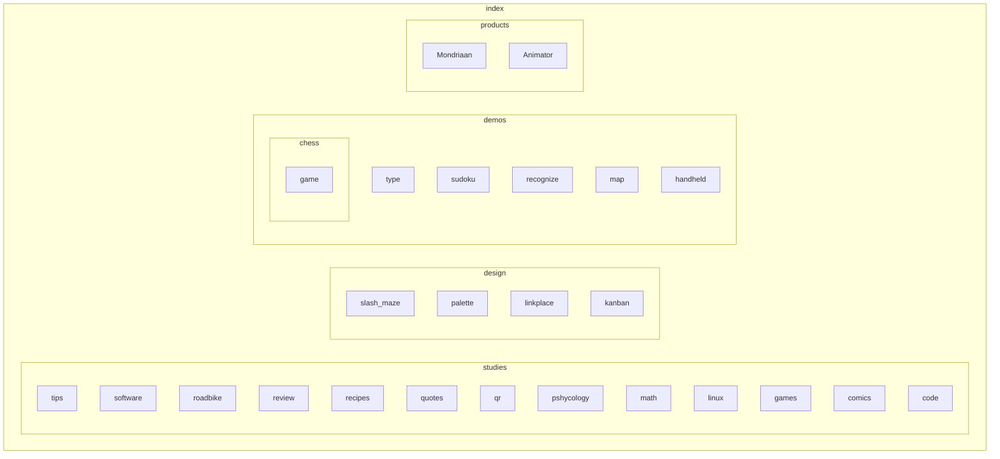
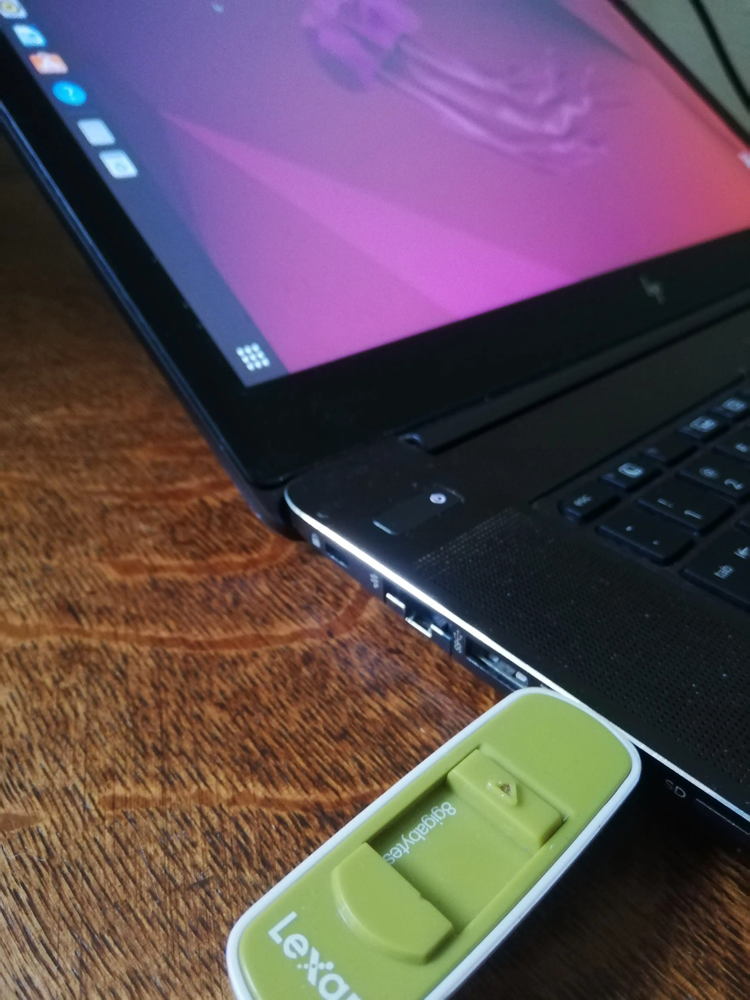

## Bread🍞 ⭐⭐⭐
size: (40 x 40) cm
A bit dry, but can easily be prepared fresh, which makes it good source of durative energy.


## Auto-off
What is the cost of a standby TV or wifi routers? Do you use them all the time? A TV maybe one hour per day, wifi routers not when you sleep. Still they are left on. The same for lights. The trade-off is only a bit of response time. Auto-off set with set time periods can make this trade-off neglible.

# Streaming
When streaming videos, you may want to consider changing the quality in the options menu. If the video does not need much detail or you listening more than watching, switch it to a lower video quality. This will save bandwith and energy.

# Human Computer Interaction

A human interacting with a human, disguished as a computer, independent of time. This field relies on the assumption that there is [hardware](hardware.md) to run on, which can take [input](input.md), process it with [software](software.md) and [output](output.md) an image or text. Note that this is not about computing, but about transmission of data, which could be a computation though. 

## Human

We all now them. You reading are also probably one! Though have you ever looked at how you do the things you do so effortlessly. We have been fine-tuned to many of the interaction we have in nature, because we are as much as part of it as we need it.

## Computer

The realm of 0's and 1's. Nature's mechanics are far away from this simple logic. Though slowly through defining stable patterns do we grow closer to a familiar nature. This simple act of 2 inputs becoming 1 output branches out in patterns describing more complex patterns.

### Input

### Computing

### Output

This closes the loop as feedback on your input. 

## Interaction

Many things taken for granted are suddenly not present anymore in interaction with computers, compared to humans. These machine, so dumb, but untransparent at the same time. Often giving the frustation of unprogress.


## Inclusive or Universal Software

Some considerations

- Language is culture depedent and requires the effort of localization to transcend that.
- Effective programs with small size and computing requirements make it device independent. Mainly audio and visuals increase size. GPU calculation increase computing requirements.

### Games specific

- Only lock is your skill. Arcade games have this, but with upfront cost.
- Allow for own creative expansion/expression
- hospitality 
- kid friendly

# Language

## Definitions

Making up words for a language!

photograph

: phos + graphê

: light + drawing

: drawing with light

wikipedia
: wiki + pedia
: fast + learning

## Quotes

> Brevity is the soul of wit - Shakespeare

> Comparison is the death of joy - Mark Twain

> “If I had asked people what they wanted, they would have said faster horses. ” - Henry Ford

> The best way to interpret the actions is not as moves intended to improve board position, but rather as moves that simplify the player's problem solving task - Kirsh & Maglio, 1994

## Glossary

Holding some alternative definitions.

GUI
: graphical representation of your code, to aid memorization. Then direct acces through representation.

slow GUI
: Electrons are incredibly fast. This is reflected in how video can create the illusion of movement through showing a sequence of images rapidly. Though for certain task you need to slow down and so you don't want your GUI to be ^jumpy^, so you know you won't get distracted and can hone in.

experience
: functionality * presentation

Scientfic method
: Iterative guessing
: Assumative freedom

presentation
: the function is independent of a medium. Thus the presentation can be through any of the senses.

function
: defining a pattern (Creation, Maintenance, Destruction / Input, Calculations, result) 

code
: a system of patterns needing to be translated to get their meaning. Thus coding is done for practical reasons, because the code can have different practicalities. For example, programming languages are there for human interpretation, but their meaning comes when it becomes binary.

video game
: exploration of functions with video and sound

loop
: undefined ending

sequence tree
: A action tree that exist over time through linear sequential calculations

guile
: sly orcunning intelligence

brawn
: physical strength in contrast to intelligence

significant
: distinct enough to act upon


### More

https://www.studiobinder.com/blog/movie-film-terms/#e
https://en.wikipedia.org/wiki/Film_editing
https://en.wikipedia.org/wiki/Glossary_of_comics_terminology#Splash
https://en.wikipedia.org/wiki/Glossary_of_video_game_terms#attract_mode

冒険 - adventure - Bōken - https://www.bing.com/translator/?ref=TThis&text=%E5%86%92%E9%99%BA&from=ja&to=en

## Poems

# 

```
As the fields sows
so reaps the mows
```

```
As un yields
The soul feels
```

```
The ware is soft
But can be structurally hardend
Like a rock
Which is not very malleable
Unlike thought
Limiting its freedom
```

```
 🐣 🐥 🐤 🐔 🥚 🐣 - 🐮 🥛 - 🌻 + 🌞 = ?
```

```
oh friction
why are you in my way
am I unoiled
for joy is the way
```

```
from pure idea
to messy implementation
test for true feedback
and evolve again
```

> the pure idea, the messy implementation, the true feedback

```
pen & paper
pan & fire
game & rules
boat & water
chair & butt
human & earth
```

[Algoryhme by Radia Perlman — EtherealMind](https://etherealmind.com/algorhyme-radia-perlman/)

# Math
I'm not sure yet what math totally encompasses.

## Data
All mata will eventually translate into just data. This is what makes math concrete and thus real. A line will always have points otherwise there is no line.

## Higher order defining
Though this concreteness has its limitations and it becomes a lot of work to store a line by noting down its points. This is only feasible for a small range with a low level of detail, so variables come to the rescue! Say `x` is any number. Then `y = x` is just a line that goes up like 1,2,3... or down like -1,-2,-3... till infinity♾️ if we don't tell it stop. Have you ever seen an infinite line? No, so then it cannot be real. Only when you define `x` does it become real. And `x` can be any number or numbers, so it could be 4 or 9 or 1 till 100 and these will all give different `y` outcomes. But they are all correct and on the same line we defined.

# Making math with math
At the beginning there was `+`, describing the additive flow of the universe. This was probably just used with small positive numbers. 
Then came negative numbers `-x`, indicating the equilibrium. Water flow means that in one point it becomes less and at another point it becomes more.
Then we became lazy and instead of working with totals we split numbers up in groups. `x * y` instead of calculating their total. Thus 5 + 5 + 5 could be shortly written as 5 * 3, since there are 3 5's. You dont have to duplicate your additions.
But then we had groups, meaning we can divide numbers. So to know how many groups, we use division `total / x`.
So then we became even lazier and came up with `power ^`. 5 * 5 * 5 could just be written as 5^3, because you have 3 times a 5 multiplication!

## Static
<https://www.w3schools.com/TAGs/tag_output.asp>
1-9*1-9 with output and option
abacus 

| x  | 0 | 1 | 2 | 3 | 4  | 5  | 6  | 7  | 8  | 9  | 10  |
|----|---|---|---|---|----|----|----|----|----|----|-----|
| 0  | 0 | 0 | 0 | 0 | 0  | 0  | 0  | 0  | 0  | 0  | 0   |
| 1  |   | 1 | 2 | 3 | 4  | 5  | 6  | 7  | 8  | 9  | 10  |
| 2  |   |   | 4 | 6 | 8  | 10 | 12 | 14 | 16 | 18 | 20  |
| 3  |   |   |   | 9 | 12 | 15 | 18 | 21 | 24 | 27 | 30  |
| 4  |   |   |   |   | 16 | 20 | 24 | 28 | 32 | 36 | 40  |
| 5  |   |   |   |   |    | 25 | 30 | 35 | 40 | 45 | 50  |
| 6  |   |   |   |   |    |    | 36 | 42 | 48 | 54 | 60  |
| 7  |   |   |   |   |    |    |    | 49 | 56 | 63 | 70  |
| 8  |   |   |   |   |    |    |    |    | 64 | 72 | 80  |
| 9  |   |   |   |   |    |    |    |    |    | 81 | 90  |
| 10 |   |   |   |   |    |    |    |    |    |    | 100 |

_multiplication table_

| + | 0 | 1 | 2 | 3 | 4 | 5  |
|---|---|---|---|---|---|----|
| 0 | 0 | 1 | 2 | 3 | 4 | 5  |
| 1 |   | 2 | 3 | 4 | 5 | 6  |
| 2 |   |   | 4 | 5 | 6 | 7  |
| 3 |   |   |   | 6 | 7 | 8  |
| 4 |   |   |   |   | 8 | 9  |
| 5 |   |   |   |   |   | 10 |

_addition table_

| + | -0 | -1 | -2 | -3 | -4 | -5 |
|---|----|----|----|----|----|----|
| 0 | 0  | -1 | -2 | -3 | -4 | -5 |
| 1 | 1  | 0  | -1 | -2 | -3 | -4 |
| 2 | 2  | 1  | 0  | -1 | -2 | -3 |
| 3 | 3  | 2  | 1  | 0  | -1 | -2 |
| 4 | 4  | 3  | 2  | 1  | 0  | -1 |
| 5 | 5  | 4  | 3  | 2  | 1  | 0  |

_subtraction table_

| - | 0  | 1  | 2  | 3  | 4  | 5  |
|---|----|----|----|----|----|----|
| 0 | 0  | -1 | -2 | -3 | -4 | -5 |
| 1 | 1  | 0  | -1 | -2 | -3 | -4 |
| 2 | 2  | 1  | 0  | -1 | -2 | -3 |
| 3 | 3  | 2  | 1  | 0  | -1 | -2 |
| 4 | 4  | 3  | 2  | 1  | 0  | -1 |
| 5 | 5  | 4  | 3  | 2  | 1  | 0  |

_subtraction table2_

| /  | 0   | 1   | 2   | 3   | 4   | 5   | 6   | 7   | 8   | 9   | 10  |
|----|-----|-----|-----|-----|-----|-----|-----|-----|-----|-----|-----|
| 0  | 0/0 |  0  |  0  |  0  |  0  |  0  |  0  |  0  |  0  |  0  |  0  |
| 1  | 0/0 | 1   | 1/2 | 1/3 | 1/4 | 1/5 |     |     |     |     |     |
| 2  | 0/0 | 2   | 1   | 2/3 | 1/2 |     | 1/3 |     | 1/4 |     | 1/5 |
| 3  | 0/0 | 3   |     | 1   |     |     | 1/2 |     |     | 1/3 |     |
| 4  | 0/0 | 4   | 2   |     | 1   | 4/5 | 2/3 |     | 1/2 |     |     |
| 5  | 0/0 | 5   |     |     |     | 1   |     |     |     |     | 1/2 |
| 6  | 0/0 | 6   | 3   | 2   |     |     | 1   |     |     | 2/3 |     |
| 7  | 0/0 | 7   |     |     |     |     |     | 1   |     |     |     |
| 8  | 0/0 | 8   | 4   |     | 2   |     |     |     | 1   |     | 4/5 |
| 9  | 0/0 | 9   |     | 3   |     |     |     |     |     | 1   |     |
| 10 | 0/0 | 10  | 5   |     |     | 2   |     |     |     |     | 1   |

_division table_

| *  | 1/0 | 1/1 | 1/2 | 1/3 | 1/4 | 1/5 | 1/6 | 1/7 | 1/8 | 1/9 | 1/10|
|----|-----|-----|-----|-----|-----|-----|-----|-----|-----|-----|-----|
| 0  | 0/0 |  0  |  0  |  0  |  0  |  0  |  0  |  0  |  0  |  0  |  0  |
| 1  | 0/0 | 1   | 1/2 | 1/3 | 1/4 | 1/5 |     |     |     |     |     |
| 2  | 0/0 | 2   | 1   | 2/3 | 1/2 |     | 1/3 |     | 1/4 |     | 1/5 |
| 3  | 0/0 | 3   |     | 1   |     |     | 1/2 |     |     | 1/3 |     |
| 4  | 0/0 | 4   | 2   |     | 1   | 4/5 | 2/3 |     | 1/2 |     |     |
| 5  | 0/0 | 5   |     |     |     | 1   |     |     |     |     | 1/2 |
| 6  | 0/0 | 6   | 3   | 2   |     |     | 1   |     |     | 2/3 |     |
| 7  | 0/0 | 7   |     |     |     |     |     | 1   |     |     |     |
| 8  | 0/0 | 8   | 4   |     | 2   |     |     |     | 1   |     | 4/5 |
| 9  | 0/0 | 9   |     | 3   |     |     |     |     |     | 1   |     |
| 10 | 0/0 | 10  | 5   |     |     | 2   |     |     |     |     | 1   |

_division table2_

try it in [output](output).

# # Rendering

Outputting a dynamic image. Utilising perception or `recognition over recall`. All will follow from that. 

## Scrolling

The display area has gotten too big to fit onto the screen, so to still be able to see it you can scroll the view to the cut off area. Sequential images can be wrapped though and thus limit scrolling only to one dimension.

## Zooming out

The image should be seen as a whole, but it is to fit onto the screen. So now we have to zoom out though you won’t see all the information, you will still have an overview. To access more information we can zoom in on a particular area, but not past the native pixel size. 

## Drawing

By hand you would keep it stateful. 

- Shaping, soft lines

- Outlining, hard lines

- Colouring, smearing polygons and sequential colour picking

- Shading, transparent grey shades

- Animating, union skinning previous frame and reusing picked colours

- Background

The pixel coordinates will be defined by positive integers x & y starting from the sequential top-left corner. The x direction goes to the right and comes first. The y direction comes second and goes down. 

```
WhiteImage = GenerateFilledImage(white)

GradientImage = GenerateFilledImage(white, black)

ScaleImage = GenerateMipsMapsImage(path-to-power-2-image)

Image = LoadImage(path)

SetImage(Node, Image) # RenderingTree handles transform
```

## Animating

There is colour animation, which keeps all the pixels in the same place and only changes their colour data, and there are transform animations, which translate and rotate and scale and skew a group of pixel data. 

### Colour animation

Since only colour data is changed, no pixel data is moved around, just like the physical screen pixels. Therefore you don’t have to clear the frame, you can just draw over it, because every pixel has a fixed place.

Resizing is also still possible if horizontal and vertical axes remain separately  resizeable, since then you just extend the boxes in the layout among those axes. 

### Transform animations

Only shape can be transformed, so you need to define a bundle of pixels called an image. But after you transform, the shape is different and the original physical pixels are not in it anymore. This means you are working with image data at a higher level and not pixel/colour data. Therefore we need to clear the previous shape and then draw the new shape on top of that.

## Communicating re-draws

The rendering state can be described as a tree. Now parts that don’t move don’t need to be redrawn, but ones that do move need to be cleared of their trail. Ideally only the parent has to redraw part of itself assuming the mover is inside its area. This also means the root can’t move since it has no parent to clear itself. Thus we can pass on which nodes in the tree have to be redrawn and the rendering will recursively re-draw.

# Physics

> All physics interactions approximate a circle, with different emphasis of its infinite edges.

- The most minimal shape is a point with only a position (and a fixed smallest size). 

- Add a radius to that to get a circle.

- Add another (perpendicular) radius to get a rectangle.

- Another radius (with equal angle differences) for a triangle.

- And so on.

```
Shape1 = GetPhysicsShape(position1, [radiuses1])

Shape2 = GetPhysicsShape(position2, [radiuses2])

CheckCollision(Shape1, Shape2)
```


## Tree structure

Forms:

- Output.Image(path) # Rectangle Free within
  - Output.Label(Instance.Name😊) # Sequenceable Non-overlapping rectangle
    - Output.Button(Instance.Foo) # Clickable
      - Output.text(Instance.Description) # wrap

Instance:

- Output.Image(Background) #Resizable Window
  - Output.Button(Open) # Horizontal ToolBar
    - Output.Button(New)
      - Output.Button(Overwrite)
  - Output.Label(Item1) # Vertical List
    - Output.Label(Item2)
      - Output.Label(Item3)
  - Output.Image(Width Background) # Horizontal Slider with Vertical List    
    - Output.Image(TextEditor)
      - Output.Button(Bold) # Horizontal ToolBar
        - Output.Button(Italics)
      - Output.Text()
    - Output.Image(Image1) # Vertical Slider with TextEditor
      - Output.Image(Image2) # Grid Layout
        - Output.Image(Image3)

Horizontal Vertical Switching, because of tree definition.

glPushMatrix() on indent;

glPopMatrix() on dedent;

# Videogames Development Page

Packaging a joyful process.

## Story

The first thing you think of when making a story in games is one where the player can make his own story. That would be the ultimate freedom. However a game is not real life, the story has to be scoped. Then there are a 2 kinds of story. A creative and responsive story. 

### Creative story

Since creation of the story is led by the player, you will not have much influence on what it will be. Thus you can't build on it, it will be emergent from the gameplay and totally unique for each player. For the game to be flexible to all these stories, the actors have to be lightweight and not invested in any deep plots. 

### Responsive story

The player has no choice here the story exist and the player can respond to it in a way he sees fit. The main interactivity here comes from limited persepective.
[Ghost Pattern used this kind of story.](https://www.gamedeveloper.com/design/deep-dive-dissecting-the-simultaneous-storytelling-in-wayward-strand)

> Our theory was that by limiting player agency and not allowing the player to have a big impact on the stories, that would open up design space within the world itself; we’d be able to create interesting, overlapping stories that are reactive to the player, while not requiring an impossible amount of branching that takes into account the player making choices that cause sweeping changes to the stories. 

### 3 way story

Have 3 parralel story tracks with switches between them.

### Hyperstory

A internet story linked with hypertext.

## The Introduction Screen

This sets you up for the experience. Here you introduce the title, configurations, audio and visuals in just one screen! The player can decide when they are ready to play. In the next screen you can show some context/story/instruction text.

## Applied Games

Games are some of the most fun people have and have big attraction. Some smart people got the bright idea to use this enjoyment to teach people something more applied. This can be basic math or grammar. If more focus is put on the simulative nature, then it can be used for trainings, such as in the military. Though you always **apply** game technology instead of enjoyment. 
It also has different names, such as Serious Games or Game+, which is how this course is called, but I think this name is more descriptive and obvious. 

### Combining the Fun and Learning

This seems like such an easy thing, and it is, but it is also very fragile. Once the game becomes to serious all fun will be lost. Unfortunaly the school system is often too serious about the things that we learn, eventhough we often forget what we learned soon after. 
There is also the book where is stated that the learning process is what makes the game fun. This is what we should acknowledge, what we learn is not where the fun lies, but just in the process itself. That is why a game without application can still be fun, eventhough learning how to jump in a video game has not much application outside the game.
Then how do does the learning process work? It is a simple feedback loop where you see what the game outputs based on your input. Lets call it the motor-sensor loop, where your motor input comes back through your senses after a short detour through the computer.

### Theory

All theory discussed will likely arise from the motor-sensor loop.

## Dialog recursion

Popups opening dialog popups all over the screen until solved, then go back to previous unsolved.

## Game+

Game-based learning, making learning serious topics fun.

Game-flow can work on a psychologocial and physiological level.

Story is the connection to the real world, it can be as short as a title.

Killers->Achievers-->Socializers-->Explorerers->Inclusivity of play with all actors

exergaming = sports

## Notes
Visuals --Explain-->Mechanics--Tell-->Story

## Web games
https://developer.mozilla.org/en-US/docs/Games/Introduction

## CPostcard names

OOT

: Attack of the hospitalilty

# Visual programming

From reading to seeing.

## Robot test
- Lego Mindstorm programming

## Visual Ouput

Geometry is well represented with mathematics. Once text and images start to be added, becomes the output more conditional, because these outputs have limited states. A range can be translated to these limited states by seting ranges for distinct intervals, though this will still have no continious feedback.

## Programming Languages

Syntax is the interface to the instruction of the machine. Like any syntax at its best when it becomes invisible, meaning here that it directly translates to some instruction sequence in the machine.

With the introduction of context a tree can be made out of the sequence.

With the introduction of state a network can be made out of the sequence. This introduces the complexity of asynchronousy.


## Boo-Libary

A practical implementation.

### Boo-Lang(uage)

Combining language ergonomics with programm possibilities.

#### Solved defintions

These definitions can used as is. They are in orderer of complexity:

- bool: `0` and `1`, `true` and `false`, `yes` and `no`

- int

- char   

- string

- text

- float

- image

- audio

- video

#### Naming

A name can be one word preferably or else multiple words bound with `-`. It will act as a meaningfull reference to an definition.

##### Conversion

Only regressive conversion is defined since lower level definitions can be represented as themselves in higher level representations.

float to int: truncate

int to bool: range divide

text to string: select newline

string to char: select char

#### Unsolved defintions

**Functions** take some parameter, which they need to solve the definitions. `y = x**2 -1` is a variable that is a function if x is not defined yet. Once `x` is defined `y` can be solved and thus can be used just as a solved definition. Though the value of a function is in the reuse and thus if `x` is changed `y` will also get a new solution. So `x` acts as a implicit parameter.

#### In-between Solvers

These make **one** definition from **two** definitions, so they rest in-between.

Symbolizing helps for shorter statements with the trade-off of more memorization, which is nullified by usage versatility. Thus here you can use both for the same results.

- add: `+`

- subtract: `-` or `+0-`

- mulitply: `*` or `++`

- divide: `/` or `*1/`

- exponentiation: `^` or `**` or `+++`

- logarithm: `//` or `^1/`

- concatenate: `,` (thus a list is a concatenation of defintions)

- smaller-than: `<` (sequenceable 0 < x < 100)

### Example

```boo
A file is a class!

# Inheritance

extends BaseClass

library = boo-files/library.boo load

# Solved defintions (constants)

integer = 5
string = Hello
list = 1 , 2 , 3 # enum, vector-N
dictionary = key : value , 2 : 3 # data-class

# Unsolved definitions (Function)

x = 0 < x < 100 # clamp between 0 and 100
f = x^2 - 2*x - 1

x = f { # condition
    # exclusive flow
    u = 5 # local
    x = 9 # cannot change x
}
x = 9 # changes f also
f = 9 # overwrite means f was false

x, y + a, b # x + a ant y + b

for i in range(20):
    print(i)
while param2 != 0:
   param2 -= 1
```

### Boo GUI(Graphical User Interface)

An Image of the functionality of the programm. A picture tells a thousand words and thus you don't need to read the whole code of the programm.

#### Visuals - Pyramid drawing

First populate the **draw stack** for one frame. This will come from parsing the scope **tree sequentially**. The **order** determines what stays on top. Childeren will **inherit parents position**, so they will be defined relatively, which allows the drawer to continue from its end position (works well with pop and push in OpenGL). Then you can draw the frame in one go. To **optimize** only a subset of the frame is redrawn, thus we need a entry point for a sub-rectangle. This will be lazy drawing, coming naturally from lazy computing. Also an image of the full interface in optimal size will be provided, which provides an initial optimization, but also can be used for editing image themes and a bootsplash.

The screen only redraws on an activation. Thus no mouse-over events, brining touchscreen and mouse closer together.

Preferably all controls are visible only being constrained by limited space, which can be solved with scroll-container.

Templates for visuals, provided through images. More complex templates can combine icons, buttons, text, backgrounds and slide handle images.

#### Physics

Visuals and Physics overlap in that they both define an area rectangle, where the visuals indicate the physics interactable area and an identity of the function. The layout can automatically be constructed by defining some hints and populating the draw stack. Interactable areas will have no overlap :) .

## Bou-lang specifications

Translating programming text to Graphical User Interfaces, to increase recognition and learnabilty. The difference between text and graphics is that graphics have clear boundaries where text can be more loose. So to cross this gap we use definitions.

### Definition list

...

### Sequencing

Two become one or union, this is true to the lowest level of which logic gates operate.

The only state is a trail left by incompleted computations.

Solvers:odd

Definitions: even

### Programm Image

To create an image from text we need to map the definitions to graphical representations. First we can get a definition tree containing all the names set for the definitions and their scope.

| Definition | Type      | Graphic      |
| ---------- | --------- | ------------ |
| X < Y < Z  | Range     | Slider       |
|            | Undefined | Button       |
|            | Boolean   | Checkbox     |
|            | Option    | Radio button |

#### Image Interaction

Now we can have interactions with the definition through its area in the image. 

#### Graphical Image Creation

We use the language that can creates an image of itself, by creating an Graphical User Interface that creates the text for that language through a visually supported interaction. This can be integrated into the generated image, by adding an`Add a Definition` Button, which inlcudes the `Branch` Definition. You would then have to choose one of the implemented defintions and configure them.

### Test

```bou
include foo, +, -, *, /, 

Pi = 355 / 113
Golden-ratio = (1 + sqr(5)) / 2
Foo = x  ( 
        Y + Z ) #implicit *
Foo2 = x + Y * Z
Foo3 = x * Y + Z
Fib = X * 1.631
Range = 0 < 100
Print(Range) # gets a random instance of the valid solutions, but can use a fixed seed for reproducibility.


Tree = A (B ( C (D , E) F ) G , H)
- A
    -B
        -C
            -D    
            -E
        -F
    -G
    -H

`=` for input and output
Parameter1 = log(controller.joystick) # input binded automatically to controller.joystick
Output.Pixel1 = Red # or just automated

Instance = Input.Load(path)

Output.new(path) # for user
Output.overwrite(path)
```



### Optimization

Memory can be tradeoff for performance by precomputing all possible values of an undefined ranged definition. This only has a cost at setup.

# Software

Dealing with memory.


## get, set, met function

var name = something
function name(): return something
function name(something): name = something
function name(..., ..., ..., ...): advanced subroutine

repeat <-while,for


## Physics

### Intersection stages

* Spherical (cheapest) 
* AABB (Axis Alligned Bounding Box)
* OOB (Oriented Bounding Box)
* Triangle (most expensive)

## Type of hackers

- White: Perform penetration testing to promote the security
- Grey: illegaly white
- Black: illegaly malicious
- Blue: Vengeance
- Red: Vigilanties
- Green: Learing

## Procedural map

volcano map: z= (1 + sin(x)+cos(y))^2

## Self-Defining

### Fibonacci Sequence

Or 0, 1, 1, 2, 3, 5, 8, 13, 21, 34, 55, 89, 144, ...
Or $$ F_n = F_n-1 + F_n-2 $$ <!--https://math.meta.stackexchange.com/questions/5020/mathjax-basic-tutorial-and-quick-reference-->
Or 
Or the golden ratio of 1.61803 39887
This sequence has intersting properies and defined by adding its previous value and its previous previous value. So it is defined by itself in the past. 

### Object

When is something a object. In terms of data structures it is often a encapsulation of sorts. Though often this data structure can just be reduces to a list, where its compents are independent of each other. Only when you define a value based on another property does encapsulation happen. So an object comes to be once it starts defining new properties from its own properties. Your hand being defined by the lower arm and them both again being defined by your upper arm, for example. It also correlates with what we think of a significance difference in size with vision.

## Design

- web aquarium with 1 fish <- food sacks which fish swim too and multiply with on refresh
- web breaker -> completed time -> refresh, everything is a breaker block, the walls, the bouncer just with differnt hp
- Progress bar chunks, with range / chunks. Optional snap to chunks. Now a minsize.
- pen -> dpi / 4
- "Note" column
- https://en.wikipedia.org/wiki/ELIZA - with <input text> and <p>response</p>
- inline form, context of instruction, unit and sequence.
- mini-form. Card with just one radio buttons list. Feedback, reading place, interestin.

adapting database
: rating <- current_rating + new_rating / total_rating + 1 
: 3 data points
: anonomous
: infinite recursions

## Recursive pathfinding


This is one iteration of finding the shortest path to a destination with no direct connection, which would be the shortest path. This showcases a path through another node seperating the route into 2, though still being completely connected. This node is chosen, because it has the shortest perpendicular distance to the shortest path. Now you can apply the same operation onto these two paths to get an potentialy even shorter path by increasing level of detail. This can be iterated until satisfied by the performance measured by `new_path / shortest_path` or by reaching a maximal level of detail. This can optionally be extended by adding weights to each path to simulate path friction.

## Machine learning

Since we are dealing with learning here there will be no truths, only probabilities of linked input and outputs, which is the realm of statistics and thus we find techniques such as logistic regression. There will be no information of the underlying mechanics of these relationships, only a probability that there exist an relationship, which may be deemed significance on some needed certainty level.

## Content within the rules

Have you ever noticed the explosion in content building in the game developers process? How is it that you hear that most of the game was made just in the last part of development? In my own development I noticed a pattern. First I would make the rules the game would use. These are very minimal and are not gameplay yet. Then I would make a minimal level, serving only to test the rules and refine them, through iterating and you can iterate a lot since the game is still so small. Then time decides when the rules are done, which is when you expand the game by filling it with content. All the content will fit into the rules you created, which are defined by the quality of the rules. From here on changing the rules is unruly. Content can still be added, but new requires a new game (which can be a sequel).

## Evolving classes

A class has a range of input and output in its first iteration. Then to evolve the class a new class is created by inheritance. This class should evolve the inherited class by widening its input or constraining its output, this is the only direction it can evolve without invalidating its superclass. If it is invalidated it is a revolution.

> You should always be able to treat a subclass object as if it were an instance of the superclass, per the principle of sustitutability. - Design by Contract
> Thus it is easy to see the direction of an optimal class. An optimal class has the widest input for flexibility, but the most constrained output for reliability. This mirrors the neurons in our brain and is why functions only return one thing, but can have multiple inputs.

## Versioning

Game series look different for each unique individual game, but there are also a lot of recurring themes. This is what makes it a series, but what underlies that is the versioning (evolution) of the same title. What we see as a new game is just a major version release, as in Game 1, then Game 2  (though it is better for the player to give the release a more descriptive name of what this version contains). Underneath those major releases are smaller evolutions, leading to a bigger release, such as Game 1.2 or Game 1.2.1. One way to do this is with [semantic versioning](https://semver.org/) [used by Godot Engine](https://docs.godotengine.org/en/stable/about/release_policy.html).

For games it can be like:

1. Release

2. Step towards new release

3. Step towards 2 and so on. 


## Publishing

Traditionally this was a job in itself. Now with the internet it is possible to self-publish. There are a couple phases you have to setup:

1. have the game source ready and be playable on its own. 

2. have a grabbing title.

3. have an exciting description.

4. have cover art.

5. have a transparent gameplay video (easiest interaction .

6. have a themed online publishing page with all exports.

7. (optionally add a content-less demo)


## Relationships

### Data structure

```json
Network = {
    A : [B , C , D , E]
    B : [C , E]
    C : [D]
    D : [A, B]
    E : [A, C]
}

Tree-of-A = {
    A : [B , C , D , E]
}

Tree-of-B = {
    B : [C , E]
    C : [D]
    E : [A]
}

List-of-A = [B , C , D , E]

List-of-B = [C,E]
```

### Visualization

types of visualization:

- network
  
  - tree (header + text-lines)
    
    - list (text-lines)
      
      - point   
        
        - properties
          
          - values

## Sequential tree

list in tree, draw list, parallizable, draw till list stops (at 2), functional/recursive list

- 1
  - 2
    - 3
      - 4
        - 5
          - 6
            - 7
              - 8    
                - 9
  - 2.2


### Recursive list

Combining accesibility of list with the structure of a tree.

## Recylce Memory

How to cleanup memory after usage? Maybe you want to get back to it and determing when you are done with it is difficult. Only when you are done with a task do you know you can `close all` for that task. But inbetween you might run out of space too, especially if it is a long task 😮️. Therefore, I propose a limited memory space, which you are comfortable using. This will force you to recycle memory spaces if you go over your limit. You can then choose wether you are finished with the task in that memory space or if the new task is more important than the old one. An example could be to set a maximum on browser tabs. You can try it out already by enforcing it yourself.

https://developer.mozilla.org/en-US/docs/Mozilla/Add-ons/WebExtensions/Working_with_the_Tabs_API

## Lateral Feedack

- Window bottom light up when clicked something.

#### Dictionary

[dictionary](https://en.wiktionary.org/wiki/dictionary)
<https://en.wikipedia.org/wiki/Wiktionary>

loc
<https://linuxconfig.org/counting-lines-of-code-with-cloc>
or
https://www.geeksforgeeks.org/wc-command-linux-examples/
or https://stackoverflow.com/questions/1358540/how-can-i-count-all-the-lines-of-code-in-a-directory-recursively

# Bookmarks

## Fun😂️
- https://github.com/acaudwell/Gource/wiki/Controls (sudo apt install gource)
- https://www.jasondavies.com/wordtree/
- https://www.ivoyager.dev/app/planetarium.html

## Insight👁️‍🗨️️

- https://steamdb.info/tech/ / https://steamdb.info/tech/Engine/Godot/

## Learning🧐️

[filter | CSS-Tricks - CSS-Tricks](https://css-tricks.com/almanac/properties/f/filter/)

https://gmtk.itch.io/platformer-toolkit/devlog/395523/behind-the-code
https://www.delftstack.com/tutorial/
https://gorillasun.de/blog/a-simple-solution-for-shape-packing-in-2d
[https://github.com/dolphin-emu/dolphin/tree/master/Data/Sys/Shaders] shaders used in dolpin

- https://isaackarth.com/papers/wfc_is_constraint_solving_in_the_wild/
  <https://www.netmotionsoftware.com/blog/connectivity/how-does-data-compression-work>
  <https://www.youtube.com/watch?v=Lto-ajuqW3w>
  and DRY?
- http://www.learnsanskrit.org/
- <http://www.learnyouahaskell.com/g>
- https://soranews24.com/2013/09/17/ninja-language-skills-boost-your-japanese-with-the-power-of-onomatopoeia/ 
  [git book](https://git-scm.com/book/en/v2)
  <https://www.playerresearch.com/learn/>
  <https://marctenbosch.com/quaternions/>

  http://howtomakeanrpg.com/a/how-to-make-an-rpg-stats.html
  https://thebookofshaders.com/05/


## Resources📦

- [WikiMedia Commons](https://commons.wikimedia.org/wiki/Main_Page)

- [FreePats project](https://freepats.zenvoid.org/index.html) sound bank of unique instruments.

- [Philharmonia sound samples](https://philharmonia.co.uk/resources/sound-samples/) It includes all standard orchestral instruments, as well as guitar, mandolin, banjo, and a vast array of different percussion instruments.

- https://polyhaven.com/

- https://www.si.edu/openaccess

- https://ambientcg.com/

- https://flatuicolors.com/

- https://hyves-smileys.immerblei.com/
- https://towardsdatascience.com/40-open-source-audio-datasets-for-ml-59dc39d48f06

- https://freesound.org/people/klankbeeld/sounds/243473/
  <https://commons.wikimedia.org/wiki/Main_Page>
  <https://upload.wikimedia.org/wikipedia/commons/8/8f/Cycling_%28track%29_pictogram.svg>
  Olympic pictograms!
  [blue marble NASA images](https://visibleearth.nasa.gov/collection/1484/blue-marble) A catalog of NASA images and animations of our home planet.


## Tools🛠️

https://ebsynth.com/
https://morsecode.world/international/translator.html
https://www.text2speech.org/
https://www.scribbr.com/apa-citation-generator/
http://www.boundingboxsoftware.com/materialize/index.php


## Plants🪴️

https://drgreen.nl/

## Uncatgorized / maybe read someday

https://bossfightbooks.com/
https://aikoncwd.itch.io/sprite-generator
https://www.timeanddate.com/astronomy/night/netherlands/eindhoven
https://www.theoryoffun.com/
CIE 1931 x-y chromaticity diagram

https://www.w3schools.com/tags/ref_keyboardshortcuts.asp

<https://kemenaran.winosx.com/posts/category-disassembling-links-awakening>: 5 & 11
https://www.internet-radio.com/
<https://bottosson.github.io/posts/colorpicker/>

https://anvaka.github.io/peak-map/#7.68/47.722/-122.237
https://weatherspark.com/

<https://apod.nasa.gov/apod/archivepix.html>
[webb](https://www.nasa.gov/sites/default/files/thumbnails/image/main_image_star-forming_region_carina_nircam_final-5mb.jpg)
<https://www.redblobgames.com/x/2203-reaction-diffusion/>
[Fractal drawing](https://www.youtube.com/watch?v=sFEYQMrWNHU>)
<https://en.wikipedia.org/wiki/Fractal_compression>
The Colours of Infinity documentary
<https://www.der-mond.de/homepagetool/moon-current-for-your-website/design-luna-calendar>mix instruction and form
<https://fasterthanli.me/articles/a-half-hour-to-learn-rust>


https://basecamp.com/features/hill-charts
https://issuu.com/tudelft-mediasolutions/docs/home-of-innovation-projecten-2022

https://archeologie.culture.gouv.fr/chauvet/fr/visiter-grotte


https://www.spaceoffice.nl/nl/satellietdataportaal/
https://www.naturalearthdata.com/
https://visibleearth.nasa.gov/collection/1484/blue-marble?page=2

https://www.littlechicken.nl/oberons-court-textureless-3d-work/

https://chronotrains-eu.vercel.app/

https://www.interrail.eu/en/plan-your-trip/sustainable-tourism-europe/why-train-is-best-option
https://itch.io/docs/creators/design

https://alexwlchan.net/2022/07/screenshots/
https://en.wikipedia.org/wiki/Inner-platform_effect


## Hardware
Allowing static components to build software on. Preferably it remeans solid and minimal as changing is expensive.
Added to the processor are input and output, which come in different forms. 

### Imaginary Ideal computer
Tablet with keyboard mat overlay, based on pressure input.
- Micro-usb output to desktop display
- Mouse/stylus/pointer/IR/joypad input
- Smooth browsing
- WebOS
- Slow, but steady and efficient performance
- Passive cooling 
- silent
- over 4 hours battery life
- Phone (small) charger
- 720p or golden-ratio
- repairable 
- physical IO
- minimum storage + shared cloud storage

<https://www.gadgetoid.com/2020/12/23/star-labs-lite-mkiii-reviewed/> / <https://www.gadgetoid.com/2022/07/05/starlabs-star-lite-mk-iv-review/>

### Specialized computing
- discrete GPU
- Desktop screen
- TV screen.
- Realtime Games
- Server storage
better to share it.

### Components
- laptop: keyboard & mouse editing, creation, connector
- mobile: transactions, consuming
- byte: computing power
- tv screen: shared visuals
- desktop screen: second screen
- bootable USB drive: portable memory

# No Mans Sky

So I got intersted in the procedural art of No Mans Sky after watching [No Man's Sky: How I Learned to Love Procedural Art](https://youtu.be/vcEA41eBOGs) and decided to give it a try. I did not try the crafting gameplay for long and switched to creative mode and got in the ship to explore this generated universe. 

I landed on this artic planet with a nice view of a [ringed planet](log/Screenshot 2022-05-13 222604.png) in the sky and then came across some procedural [plant slime animal](log/Screenshot 2022-05-13 223003.png). Turns out you can ride it and so I went [hopping](no-mans-sky/Screenshot 2022-05-13 223023.png) around on that thing. I also came across the [upper part of snake](logy/Screenshot 2022-05-13 223315.png) that was walking upright, but without feet.

Then I had seen enough and went of to the [ringed planet with a speed 78,012 u/s](log/Screenshot 2022-05-13 224219.png) otherwise I would travelling for 6 hours or real time.

On the way I also used the camera mode to take some screenshots from the [spaceship](log/May-13@22.40.12.png) and its surroundings. Interestingly you could also control the sun, of which there was still only one. I used that to make an [eclpise](log/May-13@22.41.23.png).

And later watched some more talks about No Man's Sky including [Building Worlds in No Man's Sky Using Math(s)](https://youtu.be/C9RyEiEzMiU), 

# Trying Linux on 8GB USB
`20-05-22`
Apparently it is very easy to try Linux, all you need is an [USB](log/linux_on_usb.svg) with 8 GB of storage. I tried Ubuntu and thus used this [installation tutorial](https://ubuntu.com/tutorials/install-ubuntu-desktop#1-overview).

Then , stop the booting and redirect it to the USB and your using Linux. I expected it would be more difficult... 

Then how nice is it? Well, Ubuntu said somewhere it wanted to stay out of your way, and that happens to be quite nice. Windows open in a empty space, so they don't overlap, images open with "best" zoom level and the presentation is just what you need, nothing more. The experience feels more responsive and at ease then Windows also. I tried some games that come pre-installed, like Mahjong and Mines and they are just plain old fun. I'm already a fan and will try it a bit longer to see if I could use it as a replacement on my old laptop or maybe on a new one.

Kind regards

PS:
- I Discovered you can take screenshots or record your screen with `fn + s`.
- Mouse speed with trackpad was too low for me, so I adjusted it up in the settings, but now I realised that there is some acceleration curve, though maybe a bit steep.

## Installing Ubuntu
17-05-2022

https://www.winhelponline.com/blog/you-cannot-shrink-volume-beyond-point-disk-mgmt/
https://medium.com/linuxforeveryone/how-to-install-ubuntu-20-04-and-dual-boot-alongside-windows-10-323a85271a73

## Repairing Unbootable Linux
So one day you just wake up, open your computer, and start up linux, only to see that it does not start up for some reason you cannot make out(not sure what the command text means). The last line was something along the line of `reached target Bluetooth support`. Anyway, what to do? Let's see what `Ubuntu Advanced Options` means. It has a recovery mode? That might be what I need, [let's see what recovery mode is](https://linuxhint.com/boot-ubuntu-into-recovery-mode/). There are some option to fix what is going and then I remembered Ubuntu giving notifications about memory space getting full. Could that be it? It cleans some libraries, automatically selected. And yes! It boots normally again. So just keep calm and fix it! And next time maybe backup progress of 2 weeks!

# Aestethic QR

**How do you decorate the QR code without significantly reducing its functionality?** The white background is only to increase contrast for the black pixels, which contain the information. Thus I made the background transparent. Then I made the decoration image that will go under the Qr image. Simply layering these images already works.

Though contrast still is high enough for some more wiggling room for the under image to be visible. Thus I experimented with different layer merging methods, inluded here are .

QR code generated at: <https://www.nayuki.io/page/qr-code-generator-library>
Layering done in GIMP: <https://docs.gimp.org/en/gimp-concepts-layer-modes.html>

Inspiration: Zhang, Y., Deng, S., Liu, Z., Wang, Y. (2015). Aesthetic QR Codes Based on Two-Stage Image Blending. In: He, X., Luo, S., Tao, D., Xu, C., Yang, J., Hasan, M.A. (eds) MultiMedia Modeling. MMM 2015. Lecture Notes in Computer Science, vol 8936. Springer, Cham. https://doi.org/10.1007/978-3-319-14442-9_16

<!--https://www.qr-code-generator.com/ Wifi-connecting
-->

# Code

## Morse code

Arguably one of the first digital code used by people, where dash(-) and long dask(---) are like the 0 & 1. Then by sequencing and spacing, it can represent more states , like 0101. With 26 states all the letters in the alphabet are covered and so we can transmit words, which can sequenced and spaced to create sentences and further if it was not such a pain to decipher it, but [the message might still be worth it in the end](log/morse.ogg).

### Compression

Morse code is compressed by assigning the most used letters the shortest sequences as can be seen for the letter E .

## Decimal to Binary

adding +1 in decimal as binary

Decimal | Binary
0 | 0
1 | 1
2 | 10
3 | 11
4 | 100
5 | 101
6 | 110
7 | 111
8 | 1000
9 | 1001
10 | 1010

[Binary Fingers!](https://www.mathsisfun.com/numbers/binary-count-fingers.html)


## Programming language

Essentialy the computer only knows 0 and 1. Still we programm computers using names to point to higher level concepts. The first step for this was in Assembly with command such as ADD, which represented for example 0110. Nowadays we work with named variables and functions or even objects. At this level it becomes much like a (logical) language and thus we call it **a language that you can programm in**, a programming language. This gives the benefit of using familair language concepts to instruct the machine, which only knows machine language. So somewhere it must be translated back to 0 and 1's. For example, a easy to understand line of code could be `object.moveTo( table.position )`. 

### Flavours / Dialects

There are many languages with different specs each, though also many similarities. Each one speaks more to a certain use case and it is not clear if there is an universal best language. It is still a trade-off for what you need most, though many people also pick based on what fits their thinking style the most.

### Functional

The highest level using noble mathematical concept such as pure functions, which would be great, if getting it functional would more obvious. They are also lazy, which also sounds great, until you get a massive lag spike. This could likely be overcome with proper use, but it is another layer of complexity that you have to keep in mind when writing code, compared to the lower-level languages.

### Imperative

### Declarative

## Misc

- https://inventwithpython.com/blog/2018/08/17/the-zen-of-python-explained/

## Programming languages

But still coding :). no-context-languages.

### Defining languages

1. terminals <>
2. non-terminals
3. rules
4. root

### Sequence Symbols

`-` connector
`.` end
`,` continue
`\n` `\t` `\s` space
`V_` variable, named

add, append, join `+`
subtract, negate, remove, filter `-`

### Boo Lang

#### Scoped variables

Set scope with ##### or as #9 (= #########)

### Mobile

There is little width space on mobile screen, which makes indenting and long lines of code unreadable. Next to that it has significant perfomance limitation. Thus no coding on mobile phones has happend yet. 

#### Interprative wrapped code

To enable mobile programming a new syntax is required in the form of wrapped sequence combos. Normally one action happens per line, such as `var x = 5`. In a next line you will then use this variable. This can be combined into one sentence with `foo X = 5.`.
Notice the lack of `()`, because that requires less typing and reads easier. Also notice the `.` at the end, by writing wrapped sequence, we get closer to human language and can utilize that syntax too. That also why `X` is a capital letter, since we use that too denote names, which function much the same as variables here.

## Emoji

^u^

## Markdown

Marking with text in representative ways. It works in text only mode, but can be relatively easy translated to other formats, because of its generally well defined specs. Though that makes it also so, you don't get the full functionality of for example HTML.

### Mandatory Markdown CheatSheet

| result            | code                    |
| ----------------- | ----------------------- |
| header            | `#(#####) header`       |
| *italic*          | `*italic*` / `_italic_` |
| **bold**          | `**bold**` / `__bold__` |
| ~~strikethrough~~ | `~~strikethrough~~`     |
| [link]()          | `[link](src)`           |
|    | ``         |
| `inlince code`    | \`inline code\`         |
| reference[^1]     | `[^1]`                  |

[^1]:ref

> `>`Blockquote

--- 

`---` Horizontal rule

```
code block
```

\`\`\`
code block
\`\`\`

1. index
2. index2
3. index3

```
1. index
2. index2
3. index3
```

- list
- list2
- list3

```
- list
- list2
- list3
```

For tables use: <https://www.tablesgenerator.com/markdown_tables>

### Combos

Combinations of characters with variable content that serve a some function.


*caption*

Contents

- [Underline](#underline)
- [Indent](#indent)
- [Center](#center)
- [Color](#color)

### Thumbnail

[](https://www.youtube.com/watch?v=iik25wqIuFo)]
[]()

### Q&A

What is FAQ?
: Frequently Asked Question, though often they are just made up.

### Breadcrumb

[x]() / [y]() / [z]()

### Calender

## Januari

1 | 2 | 3 | 4 | 5 | 6 | 7
8 | 9 | 10 | 11 | 12 | 13 | 14
15 | 16 | 17 | 18 | 19 | 20 | 21
22 | 23 | 24 | 25 | 26 | 27 | 28
29 | 30 | 31

## Februari

1 | 2 | 3 | 4 | 5 | 6 | 7
8 | 9 | 10 | 11 | 12 | 13 | 14
15 | 16 | 17 | 18 | 19 | 20 | 21
22 | 23 | 24 | 25 | 26 | 27 | 28
(29) | 

## Maart

1 | 2 | 3 | 4 | 5 | 6 | 7
8 | 9 | 10 | 11 | 12 | 13 | 14
15 | 16 | 17 | 18 | 19 | 20 | 21
22 | 23 | 24 | 25 | 26 | 27 | 28
29 | 30 | 31

## April

1 | 2 | 3 | 4 | 5 | 6 | 7
8 | 9 | 10 | 11 | 12 | 13 | 14
15 | 16 | 17 | 18 | 19 | 20 | 21
22 | 23 | 24 | 25 | 26 | 27 | 28
29 | 30

## Mei

1 | 2 | 3 | 4 | 5 | 6 | 7
8 | 9 | 10 | 11 | 12 | 13 | 14
15 | 16 | 17 | 18 | 19 | 20 | 21
22 | 23 | 24 | 25 | 26 | 27 | 28
29 | 30 | 31

## Juni

1 | 2 | 3 | 4 | 5 | 6 | 7
8 | 9 | 10 | 11 | 12 | 13 | 14
15 | 16 | 17 | 18 | 19 | 20 | 21
22 | 23 | 24 | 25 | 26 | 27 | 28
29 | 30 

## Juli

1 | 2 | 3 | 4 | 5 | 6 | 7
8 | 9 | 10 | 11 | 12 | 13 | 14
15 | 16 | 17 | 18 | 19 | 20 | 21
22 | 23 | 24 | 25 | 26 | 27 | 28
29 | 30 | 31

## Augustus

1 | 2 | 3 | 4 | 5 | 6 | 7
8 | 9 | 10 | 11 | 12 | 13 | 14
15 | 16 | 17 | 18 | 19 | 20 | 21
22 | 23 | 24 | 25 | 26 | 27 | 28
29 | 30 | 31

## September

1 | 2 | 3 | 4 | 5 | 6 | 7
8 | 9 | 10 | 11 | 12 | 13 | 14
15 | 16 | 17 | 18 | 19 | 20 | 21
22 | 23 | 24 | 25 | 26 | 27 | 28
29 | 30 

## Oktober

1 | 2 | 3 | 4 | 5 | 6 | 7
8 | 9 | 10 | 11 | 12 | 13 | 14
15 | 16 | 17 | 18 | 19 | 20 | 21
22 | 23 | 24 | 25 | 26 | 27 | 28
29 | 30 | 31

## November

1 | 2 | 3 | 4 | 5 | 6 | 7
8 | 9 | 10 | 11 | 12 | 13 | 14
15 | 16 | 17 | 18 | 19 | 20 | 21
22 | 23 | 24 | 25 | 26 | 27 | 28
29 | 30 

## December

1 | 2 | 3 | 4 | 5 | 6 | 7
8 | 9 | 10 | 11 | 12 | 13 | 14
15 | 16 | 17 | 18 | 19 | 20 | 21
22 | 23 | 24 | 25 | 26 | 27 | 28
29 | 30 | 31

# A man approaches
1. Greet him *He says hi back*
2. Stare at him *He stares back*
3. Close your eyes at him *He closes his eues back*
Is this man a mirror?


# End
So the hero defeated the dragon after all and got into the castle back again with large applause from all the citizens living in the castle! They were overjoyed by their new gained freedom now that the rein of the dragon was gone. You get a message from a courier.
> The King was expecting and requests a meeting with you!
You cannot refuse such an offer and take the courier as your guide to the king. Finally you arrive after walking many stairs with the king sitting in its throne. He quickly dispells the discussion he was having after gazing your entry.
> Ho Ho Welcome young lad/lass! It is great to see you back in one piece! Now then, the reward I promised for defeating the dragon. 

# RPG lookup
<https://www.google.com/search?q=skill+table&client=ubuntu&hs=Rng&channel=fs&source=lnms&tbm=isch&sa=X&ved=2ahUKEwi0t8GEg9H4AhWQt6QKHcF2B0UQ_AUoAXoECAEQAw&biw=1920&bih=968&dpr=1#imgrc=ZHhiiqi48Jhf0M>
<https://www.youtube.com/watch?v=Ogby2kXY6o8>
<https://forums.rpgmakerweb.com/index.php?threads/stat-complexity.49446/>

Item | Ranger | Paladin | Cleric | Druid | Custom
---  |---    |---      |---     |---    |---
Staff | 0 | 0 | 1 | 1 | <input type="number">
Sword | 2 | 1 | 0 | 0 | <input type="number">
Dagger| 1| 0 | 0 | 1 | <input type="number">
Axe | 0 | 0 | 0 | 0 | <input type="number">

## character stats

Johannes the Third | ❤️Health: 75 | 🎚️🛗LVL: 2 | 
- ATK⚔️: 86 
- MAT🪄: 86 
- AGI🔋: 86 
- LUK🌟: 56
- MDF🪄🛡️: 43
- DEF🛡️: 23

Party Members | ATK | MAT | AGI | DEF | MDF | LUK
---|---|---|---|---|---|---
Joannes | 4 | 7 | 4 | 2 | 3 | 4
Jade | 2 | 6 | 7 | 8 | 3 | 2 
Darka | 4 | 7 | 5 | 3 | 4 | 2
Brakor | 5 | 7 | 2 | 4 | 3 | 1

Origin
56/80
🛡️Defense 2
⚔️Attack  5
🌟Luck    6

<!--https://tier-zoo.fandom.com/wiki/Stats-->

# Polymon

| Name                 | stamina | power | defense | intelligence | mobility | stealth | Health | Intimidation | Resolve | Note                                 |
|----------------------|---------|-------|---------|--------------|----------|---------|--------|--------------|---------|--------------------------------------|
| [Flameo](flameo15x.png) | 3       | 4     | 2       | 1            | 4        | 1       | 1      | 5            | 3       | Pretty hot to touch                  |
| Jankey               | 3       | 5     | 2       | 1            | 2        | 1       | 2      | 3            | 2       | Swings about                         |
| Pananaka             | 2       | 2     | 4       | 3            | 3        | 3       | 4      | 2            | 4       | Lying flat till the moment of action |
| Jereo                | 3       | 2     | 2       | 3            | 3        | 2       | 4      | 2            | 4       | Waits upon the moment to stumble     |
| [Akalaka](akalaka15x.png)|5       | 5     | 4       | 1            | 2        | 0       | 2      | 1            | 1       | Pretty impressive massive creature.  |
| Kanandee             |         |       |         |              |          |         |        |              |         |                                      |
| [Difiwigipi](pocketanimal.svg)    |  
| Monkys
| Doirtos
| Krazey
| Junzo

# Hello World in different languages. `Hello World`

## C

```c
#include <iostream>
 
int main() {
    std::cout << "Hello World";
    return 0;
}
```

## C++

```cpp
#include <iostream>
 
int main() {
    std::cout << "Hello World";
    return 0;
}
```

## Matlab

```matlab
disp('Hello World');
```

## C#

```csharp
namespace HelloWorld
{
    class Hello {        
        static void Main(string[] args)
        {
            System.Console.WriteLine("Hello World");
        }
    }
}

```

## Haskell

```haskell
module Main where

main :: IO ()
main = putStrLn "Hello World"
```

## Pascal

```pascal
program Hello;
begin
  writeln ('Hello, world.');
end.
```

## Java

```java
import java.io.*;
 
class GFG {
    public static void main (String[] args) {
       System.out.println("Hello World");
    }
}
```

## JavaScript

```javascript
console.log("Hello World");
```

## GDScript

```gdscript
print("hello world")
```

# Sokopop

Phone Gameboy Interface. 4:3 Zoomed in. Static screens + screens that move. paused ConfirmDialog Text popup with pause music. White BG titlscreen with title, characters and credits (from kirby game). ball balloon (inhale), boost(exhale) movement. You can go almost anywhere if you see it.

# Dialogues

Fictional dialogues between fictional characters. Planned to parse for dialogue.

## Passerbys

1
: Oops, sorry I was not paying attention there.

2
: Wow you had quite some force with that collision.

1
: Yeah I have to be somewhere soon, here let me help you up.

2
: Thank you, but next time please just watch out and keep your phone in the pocket maybe?

1
: Ah that makes sense, though the pockets in these pants are only for decoration.

2
: Uhh what that does not make any sense, I mean what year are we living?!

1
: Yeah idk fashion I guess. 

2
: There are soo many pocket items! Pocket phones, pocket keys, pocket food, pocket...

1
: Yes I get it! Don't judge my poor sense for utility, I too was deveceived by the fake pockets.

2
: ...

1
: Okay have to go now! 

## Developer Notes

player
: lalala, I am just walking throughout this game world.
: Oh what is this? A note lying around in this random place? *picks it up*

Note
: Thanks for reading this!

player
: What was that about? *slightly confused*
: I dunno. Lalala. *keeps on walking*

## Choice

What do I choose now?
: [Apples]
: [Potatoes]
: [Strawberry]

## Dict

{player:"lalala, I am just walking throughout this game world.",

player: "Oh what is this? A note lying around in this random place? *picks it up",

Note: "Thanks for reading this! ",

player: "What was that about? *slightly confused*'',

player: "I dunno. Lalala. *keeps on walking"}

# Roadbike

About bike maintenance in minimal form.

## Wielen

De contact punten met de weg en dus het meest significant voor de wegligging. Dus de meest effeciente plek voor onderhoud!

**achterwiel** : Dit wiel duwt je voort. 

**voorwiel** : Complementeert het achterwiel.

**binnenband** : Als je je binnenbanden gaat repareren dan kun je je fiets natuurlijk 
niet daar op laten staan! Dus flip je fiets om en zet hem stabiel op het
 zadel en stuur. Daarna kun je de band rustig inspecteren voor sherpe 
deeltjes, die wil je eruit halen. Ook handig om die plek te markeren, 
want grote kans dat daar een gaatje zit. Dan om de buitenband eraf te 
halen zijn verschillende methodes.

<table>
<tbody><tr>
<th>Omstandigheid</th>
<th>Methode</th>
</tr>
<tr>
<td>Buitenband zit losjes</td>
<td>Gebruik de palmen van je hand om de band los te maken.</td>
</tr>
<tr>
<td>Buitenband zit strak</td>
<td>Gebruik wippertjes.</td>
</tr>
<tr>
<td>Buitenband is niet los te maken</td>
<td>Gebruik mijn gepatenteerde techniek :). Zet een wippertje onder de 
band, dit is het entree punt. Nu zet er een wippertje onder het 
uitsteeksel dat je zojuist heb gemaakt. Dit kan een beetje peulen zijn. 
Pak het derde wippertje en doe weer hetzelfde met het nieuwe ingezette 
wippertje. Laat het het eerste wippertje staan. Werk dan beetje bij 
beetje met de twee wippertjes om en om door totdat de band loskomt.</td>
</tr>
</tbody></table>

Nu kun de buitenband eruit te halen is kun je voor 
gaatjes checken. Pomp de binnenband op en luister of je ergens lucht 
uitstroom hoort. Dit is alleen hoorbaar met grotere gaatjes. Daarna ga 
je met je hand als een koker om de hele band heen. Als er een gaatje is 
kun je de lucht uitstroom voelen blazen. Markeer alle gaatjes die je 
vindt. 

Volg daarna de specifieke instructies van het plaksetje 
wat je hebt gekocht. Hiermee is het gaatje afgesloten en kun je testen 
of de band lucht weer vasthoud, zodat je erop kunt fietsen met enige 
demping.

## Human contact points

**zadel** : Je kan niet gemakkelijk staand fietsen dus dan maar zittend op een zadel.

**Stuur** : Je moet je handen ergens kwijt! En je kan er ook nog mee sturen!

**Trappers** : Dit is het contact punt met het achterwiel.

## Connectors

**Ketting** : Bindt trappers en achterwiel samen.

**Frame** : Die bindt alles samen!

## Extra

**fietstas** : Als je op reis gaat heb je meer spullen nodig dan een enkel fietstochtje 
mocht je het vol willen houden. Je wilt het graag zo minimaal mogelijk 
houden aangezien je het elke trap mee neemt

## More about bikes

[Dutch bike Wikipedia](https://nl.wikipedia.org/wiki/Fiets) , because they arguably utilize bikes the most on the world.


<table>
  <tr>
    <th>Skills</th>
    <th>Level 1</th>
    <th>Level 2</th>
    <th>Level 3</th>
    <th>Level 4</th>
    <th>Level 5</th>
    <th>Level 6</th>
  </tr>
  <tr>
    <td>Charisma</td>
    <td><input type="radio" name="charisma"></td>
    <td><input type="radio" name="charisma"></td>
    <td><input type="radio" name="charisma"></td>
    <td><input type="radio" name="charisma"></td>
    <td><input type="radio" name="charisma"></td>
    <td><input type="radio" name="charisma"></td>
  </tr>
  <tr>
    <td>Endurance</td>
    <td><input type="radio" name="endurance"></td>
    <td><input type="radio" name="endurance"></td>
    <td><input type="radio" name="endurance"></td>
    <td><input type="radio" name="endurance"></td>
    <td><input type="radio" name="endurance"></td>
    <td><input type="radio" name="endurance"></td>
  </tr>
</table> 


<table>
  <tr>
    <th>Intersection</th>
    <th>+4 appeal</th>
    <th>+7 bargaining</th>
    <th>+2 luck</th>
    <th>+9 emotional stability</th>
    <th>+1 shoe size</th>
    <th>+7 tinkering</th>
  </tr>
  <tr>
    <td>-8 tinkering</td>
    <td><input type="checkbox"></td>
    <td><input type="checkbox"></td>
    <td><input type="checkbox"></td>
    <td><input type="checkbox"></td>
    <td><input type="checkbox"></td>
    <td><input type="checkbox"></td>
  </tr>
  <tr>
    <td>-3 coolness</td>
    <td><input type="checkbox"></td>
    <td><input type="checkbox"></td>
    <td><input type="checkbox"></td>
    <td><input type="checkbox"></td>
    <td><input type="checkbox"></td>
    <td><input type="checkbox"></td>
  </tr> 
  <tr>
    <td>-6 stress-resistance</td>
    <td><input type="checkbox"></td>
    <td><input type="checkbox"></td>
    <td><input type="checkbox"></td>
    <td><input type="checkbox"></td>
    <td><input type="checkbox"></td>
    <td><input type="checkbox"></td>
  </tr>
  <tr>
    <td>-3 mutation resistance</td>
    <td><input type="checkbox"></td>
    <td><input type="checkbox"></td>
    <td><input type="checkbox"></td>
    <td><input type="checkbox"></td>
    <td><input type="checkbox"></td>
    <td><input type="checkbox"></td>
  </tr>
  <tr>
    <td>-10 bargaining</td>
    <td><input type="checkbox"></td>
    <td><input type="checkbox"></td>
    <td><input type="checkbox"></td>
    <td><input type="checkbox"></td>
    <td><input type="checkbox"></td>
    <td><input type="checkbox"></td>
  </tr>
</table> 

# Screen Edge room

<http://www.mmds.org/>

<https://core-design.com/goodies_tr1_gamedesigndocuments.html>
<https://famicom.party/>

Mythical & mystical atmosphere

# Type return
<www-cs-students.stanford.edu/~amitp/Articles/NPC-Conversation.html>
Con-text with **bolded** targets.
instructions consisting of set action and unset target with optional comment and actor.
`actor/action: target`


## Setting
prod the people of this unfamilair place full of puzzely connections. Give items to people, shelves, chest. Sleep the night over in one of the local inns. Talk to the many inhabitants of the town and discover bits of info about how people are connected to this place. Maybe you could even do a helpful deed here and there. 

## People

### Jane
Adventure women also on a journey. She is hanging out at the plaza looking for other travelers to chat too. 

### Barney
Runs the inn with the cheapest prices for beer, though staying the night will cost you more. Generally a nice guy, but does not know when to stop talking and spills a town's secret out every other day.

### Kathena
Has a total of 9 cats, though one went missing and missing posters are put around the whole town. It is one of the youngest cats, so she is a bit worried about his lone survival capabilities.

### Direk
Runs the only carnaval shop with a variety of customes, smoke candles and some fun stuff.

## Town
The people that inhabitat it have the habitat of being individualistic. So the streets end up being pretty quiet when it is time for the kids to go home. Also, the network connections are few, though the whole town is one clique. Therefore they don't mind talking to strangers for a change in conversation. 