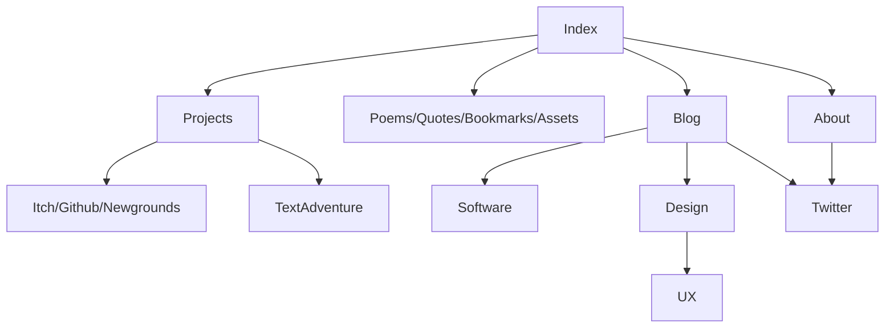

# Website
[Website](https://boukew99.github.io/) using [Markdown](https://docs.github.com/en/get-started/writing-on-github/getting-started-with-writing-and-formatting-on-github/about-writing-and-formatting-on-github) and [Github Pages](https://docs.github.com/en/pages) by [boukew99](https://github.com/boukew99). 

  

https://www.markdownguide.org/cheat-sheet/ -> https://emojipedia.org/

Take a peek [behind the curtains](https://github.com/boukew99/boukew99.github.io/blob/main/make_md_site.md?plain=1)
## Interaction
First of is navigation. This will simply be solved by scrolling. Though not all content needs to be always loaded thus scrolling is combined with links, which indicate what you want load, which will take you to that page. These rules set up the constraints for page design. First every loaded element is visibile otherwise it cannot be accesed by scrolling. Though you don't want to do too much scrolling so organize the page with care. Second, divide you website into functional pages, so the user has to do minimal loading and can acces the page independently (from anywhere). Try to provide a header (with #header) link too for an external links too provide extra context.

Then once we need a form for user input, then just use the provided `<input>` HTML, which needs differnt interaction depending on input type.

## Navigation Flowchart

## Markdown Components
Templates usable throughout the website. Just copy, paste and edit them.

### Navigation bar
```
[link1]() | [link2]() | [link3]()
```
Typically on the top or bottom to act as a recognizable escape point.


### Tree structure
```
# Title
description


## 1
### 1.1
```

https://www.favicon.cc/


### Elements
[](https://www.youtube.com/watch?v=iik25wqIuFo)]

```gdscript

var lol = "nice"

func _ready:
	pass
```

[markdown source](make_md_site.md)

### Code Transparency
Every webpage has to send its code to be rendered, so everything you see is code that is send. This you can `Inspect` by pressing f12 in the browser (or in the context menu).

<https://en.wikipedia.org/wiki/Breadcrumb_navigation>
[x]() / [y]() / [z]()

<https://www.w3schools.com/cssref/css3_pr_filter.asp>
img {
  border-radius: 50%;
}

### Thumbnail
[](img)

### filter
[category1]() | [category2]() | [category3]() | [category4]()
or with *tags*


### wiki
<a href=wiki.md download>md download</a>
[wiki download](wiki.md)
<a href=wiki download>html download</a>

#### Name

 --- | ---
[Developer](https://en.wikipedia.org/wiki/Video_game_developer) | XXX
[Programmer](https://en.wikipedia.org/wiki/Video_game_programmer) | XXX
[Platform](https://en.wikipedia.org/wiki/Computing_platform) | [Windows](https://en.wikipedia.org/wiki/Microsoft_Windows)
[Genre](https://en.wikipedia.org/wiki/Video_game_genre) | [Platform](https://en.wikipedia.org/wiki/Platform_game)


<https://uxmag.com/articles/native-or-web-based-selecting-the-right-approach-for-your-mobile-app>

<https://goose.game/>

<https://www.littleworkshop.fr/>
<https://nova.app/>
<https://panic.com/>


### Mandatory Markdown [Reference](https://commonmark.org/help/))/CheatSheet
`### Mandatory Markdown Reference/CheatSheet`

result | code
---|---
*italic* | `*italic*` / `_italic_`
**bold** | `**bold** / `__bold__`
[link]() | `[link]()`
 | ``
`inlince code` | \`inline code\`

>Blockquote

`>Blockquote`

--- 
`---` Horizontal rule

1. index
2. index2
3. index3
```
1. index
2. index2
3. index3
```


- list
- list2
- list3
```
- list
- list2
- list3
```


```
code block
```

\```
code block
\```


### Table

Name/Order Naming | A | B | C | ... | Categories
---               |---|---|---|---  |
1 | | | | | | 
2 | | | | | |
3 | | | | | |


### File properties
Created: wo 29 jun 2022
Modified: wo 29 jun 2022
Size: 4,2 kB

link to header with #abcd

[404](404.md)

## Recursive list
Combining accesibility of list with the structure of a tree. Without navigating the tree.

## Tag words & structural words
News is a tag
Log is a structure

## Emoticons
📰 📅 🥦 🔖 🔗 🆕

## Patterns
Open in [Github](https://github.com/boukew99/boukew99.github.io/blob/main/make_md_site.md) to get a copy button.

### HTMl Table three columns
Minimal Table size for reocurring properties.

<!-- https://github.com/github/linguist/blob/master/lib/linguist/languages.yml -->
```html
<table>
	<caption>...</caption>
	 <tr>
  	<th>Instances</th>
    <th>property B</th>
    <th>property C</th>
  </tr>
  <tr>
    <td>Instance 1</td>
    <td>1</td>
    <td>2</td>
  </tr>
  <tr>
    <td>Instance 2</td>
    <td>2</td>
    <td>1</td>
  </tr>
</table>
```

<div width=200 style="background: rgb(2,0,36); background: linear-gradient(30deg, rgba(2,0,36,1) 0%, rgba(9,9,121,1) 16%, rgba(238,68,220,1) 32%, rgba(226,48,48,1) 46%, rgba(255,183,47,1) 63%, rgba(230,227,22,1) 77%, rgba(18,164,10,1) 87%, rgba(2,0,36,1) 100%);" 
</div>

