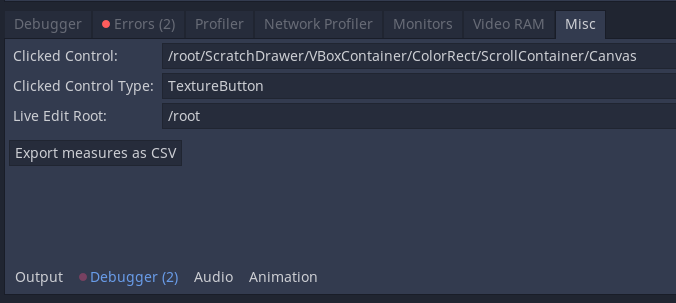

# Godot Editor tutorial
"Something like that would be handy here" -> it likely exist, since someone else came across it and contributed.

## Personal Node use cases

Node | use
--- | ---
Position2D | Origin Marking
Button | function
Checkable | boolean
Spinbox | number set
Slider | range
Line Edit | String
Tab Container | Task switch
Scroll Container  | View
Control  | Node1D
H/vBoxConatainer | Switch
PanelContainer | Level
Panel | Background
GridContainer | HBox wrap

<https://raw.githubusercontent.com/godotengine/godot-docs/master/img/tween_cheatsheet.png>
<https://easings.net/>

```gdscript
# 128 px high jump!


extends KinematicBody2D
var gravity = 981
var jump_height = -sqrt(2 * gravity * 128 px)
var velocity = Vector2(0, 0)

func _process(delta):
    if is_on_floor() and Input.is_action_just_pressed("jump"):
        velocity.y = -jumpheighy

    move_and_slide(velocity, Vector2.UP)

    velocity.y += gravity * delta
```

## Ordinal input
- Option button +

## Reading 
Q: Why Projection and not Matrix4?
A: Godot does not use Matrix2, Matrix3, Matrix4x3, etc. naming convention because, within the engine, these types always have a purpose. As such, Godot names them: Transform2D, Transform3D or Basis. In this case, this 4x4 matrix is always used as a Projection, hence the naming.

That is also what distinguishes an asset from a Resource.

## Debugging GUI
Display what you actually clicked, when you cannot click something else.


## code test
```gdscript

var lol = "nice"

func _ready:
	pass
```
