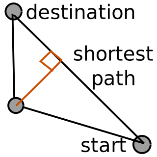

# Software
Dealing with memory.

## Inclusive or Universal Software
Some considerations
- Language is culture depedent and requires the effort of localization to transcend that.
- Effective programs with small size and computing requirements make it device independent. Mainly audio and visuals increase size. GPU calculation increase computing requirements.

### Games specific
- Only lock is your skill. Arcade games have this, but with upfront cost.
- Allow for own creative expansion/expression
- hospitality 
- kid friendly

## Respecting the default
<https://grugbrain.dev/#grug-on-chestertons-fence>

## software evolution process
?

## Files
Everything is just stored as a file. extension don't matter for filesystem, they just describe different dimensions (of a folder).

## get, set, met function
var name = something
function name(): return something
function name(something): name = something
function name(..., ..., ..., ...): advanced subroutine

repeat <-while,for

## Extra-Ordinary Programming
Code extremely obvious actions.

## Self-organizing foldering
- Define files localy 

### Recursive list
Combining accesibility of list with the structure of a tree.

## Physics

### Intersection stages
* Spherical (cheapest) 
* AABB (Axis Alligned Bounding Box)
* OOB (Oriented Bounding Box)
* Triangle (most expensive)

## LITE
Software without the bells and whistles.

## Self-Defining
### Fibonacci Sequence
Or 0, 1, 1, 2, 3, 5, 8, 13, 21, 34, 55, 89, 144, ...
Or $$ F_n = F_n-1 + F_n-2 $$ <!--https://math.meta.stackexchange.com/questions/5020/mathjax-basic-tutorial-and-quick-reference-->
Or 
Or the golden ratio of 1.61803 39887
This sequence has intersting properies and defined by adding its previous value and its previous previous value. So it is defined by itself in the past. 

### Object
When is something a object. In terms of data structures it is often a encapsulation of sorts. Though often this data structure can just be reduces to a list, where its compents are independent of each other. Only when you define a value based on another property does encapsulation happen. So an object comes to be once it starts defining new properties from its own properties. Your hand being defined by the lower arm and them both again being defined by your upper arm, for example. It also correlates with what we think of a significance difference in size with vision.

## Design
- web aquarium with 1 fish <- food sacks which fish swim too and multiply with on refresh
- web breaker -> completed time -> refresh, everything is a breaker block, the walls, the bouncer just with differnt hp
- Progress bar chunks, with range / chunks. Optional snap to chunks. Now a minsize.
- pen -> dpi / 4
- "Note" column
- https://en.wikipedia.org/wiki/ELIZA - with <input text> and 
response

- inline form, context of instruction, unit and sequence.
- mini-form. Card with just one radio buttons list. Feedback, reading place, interestin.

adapting database
: rating <- current_rating + new_rating / total_rating + 1 
: 3 data points
: anonomous
: infinite recursions

## Recursive pathfinding

This is one iteration of finding the shortest path to a destination with no direct connection, which would be the shortest path. This showcases a path through another node seperating the route into 2, though still being completely connected. This node is chosen, because it has the shortest perpendicular distance to the shortest path. Now you can apply the same operation onto these two paths to get an potentialy even shorter path by increasing level of detail. This can be iterated until satisfied by the performance measured by `new_path / shortest_path` or by reaching a maximal level of detail. This can optionally be extended by adding weights to each path to simulate path friction.
 

