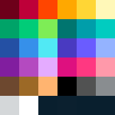

# Palettes

_greyyellow - b5b5b5 cac46c e6de61 ecde09_

_blueprint_

_mondriaan_

_r/place 2022 - ffffff 3690ea 000000 ff4500 811e9f b44ac0 ffd635 be0039 2450a4 6d482f ffa800 ff99aa 00756f 493ac1 515252 898d90 d4d7d9 7eed56 ffb470 9c6926 00cc78 00a368 ff3881 94b3ff 009eaa 51e9f4 fff8b8 6d001a de107f 00ccc0 6a5cff e4abff_

<!--https://en.wikipedia.org/wiki/R/place-->
<!--https://townsean.github.io/canvas-pixel-color-counter/-->

## More
- <https://lospec.com/palette-list/pico-8>
- <https://ewenme.github.io/ghibli/>
- <http://designmadeinjapan.com/magazine/graphic-design/the-rich-colors-of-studio-ghibli/>

## Input Table
For dynamic color palletes at [Shadertoy](https://www.shadertoy.com/view/ll2GD3), using
$color(t) a + b * \cos{2n(c*t+d)}$.

| pallete | a | b | c | d |
|---      |---|---|---|---|
| rainbow | 0.5, 0.5, 0.5 |	0.5, 0.5, 0.5	| 1.0, 1.0, 1.0	| 0.00, 0.33, 0.67 |
| cliff waters | 0.5, 0.5, 0.5	|	0.5, 0.5, 0.5	| 1.0, 1.0, 1.0 |	0.00, 0.10, 0.20 |

sky-blue: #4187d8
