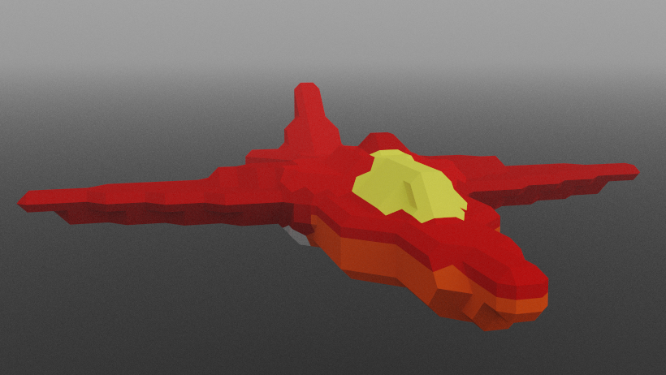

# Portfolio
Developing with a focus on accesibility.

## Skill Table⭐
Besides basic university engineering skills I list here mainly hard skills with a rating from 1 to 3 roughly indicating my experience level. 
Education:	MS in HTI, TU/e. Thesis: "...".

Skill Level | ⭐☆☆ | ⭐⭐☆ | ⭐⭐⭐
---   | ---    | ---      | --- 
Electrical | Circuits, PID Systems| Computer building blocks, Instruction Sets | 
Native 🖥️ | C, C++, Raylib, Java, Unity Engine, Git, SQL, Matlab, Unity, GLSL, Weka | Python, Gamemaker Studio 2, AI, Logic & Set  | Godot Engine, GDScript, Fundamentals
Language 💬 | French | German |Dutch, English 
Psychology | RStudio | Stata, data analysis, qualitiative | perception, social, society, human factors
Web 📱  | Javascript, CSS | W3.CSS, TCP, UDP, Networks, Security | HTML, Markdown, JSON 
Design 🌻 | | Icons, Piksel, OOP, Abstraction | UX, UI, GUI, Leaness
Academic 🎓 | |Statistics, Writing | Reading
Music 🎹 | GarageBand, Harmonica, Sonic Pi | Guitar, Audacity | Piano, Keyboard
OS(user) | | Ubuntu, Android | IOS, Windows

## Native projects💻
Software sources are hosted on [Github](https://github.com/boukew99) and playable demos on [itch.io](https://howyoudoing.itch.io/). Generally I use the [Godot Engine](https://godotengine.org) for native development for its small binary size and ease of use. I have made some repositories available on the [Godot Asset Library](https://godotengine.org/asset-library/asset?category=&godot_version=&sort=updated&filter=boukew99).

## Video Games🎮 
Most games are pretty experimental. sample: [Space Evader👾](https://itch.io/embed-upload/2869595?color=ebdf64).
During Game jams I made space games, topdown sawblade simulator, perception game, chicken🐔 farm sim, puzzle box, light☀️ puzzle, platformers🤸‍♀️.

## Web projects🕸️
I just use HTML, CSS & JS. I like the wide use case it serves. All project are on this website. [source](https://boukew99.github.io)

## FAQ
What do you like to do?
: UX design / Engineer

What technologies do you use?
: HTML, CSS, JS for small projects and Godot Engine for bigger projects.

What I can offer?
: User test your product and log a report about it. Make an MVP of a design. Or just simply some consultation.

What do you care for?
: Universal design of technology. 

