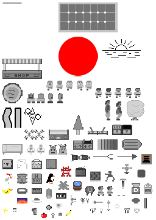

# [Flooded](../)
In Flooded I tried to make a art in greyscale and small image size, which makes the image generic in a way. Then adding post-effects, to make the art express more depending on the context.