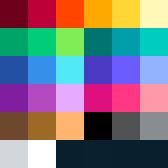

# Palettes

* greyyellow = b5b5b5 cac46c e6de61 ecde09

<!--https://en.wikipedia.org/wiki/R/place-->
<!--https://townsean.github.io/canvas-pixel-color-counter/-->

r/place 2022 | white   | blue | black  | red | dark purple | purple | yellow | dark red | dark blue | dark brown | orange | light pink | darkish green | another blueish | dark grey | grey | light grey | light green | lightish orange | brown | green | dark green | pink | light blue | green blue | ightish blue | red brown | pink | ? | ? | ? | total
---          |---
Pixels       | 8387552 | 2245600 | 14891744 | 4415760 | 1061440 | 513696 | 3666720 | 2709056 | 3815248 | 1104672 | 2691392 | 1048880 | 581104 | 349568 | 989024 | 2015952 | 2216704 | 1050032 | 1004512 | 1508016 | 701104 | 1766480 | 536816 | 382464 | 225936 | 1985120 | 750528 | 657440 | 178992 | 107760 | 266784 | 173904 | 64000000	
hex codes    | ffffff | 3690ea | 000000 | ff4500 | 811e9f | b44ac0 | ffd635 | be0039 | 2450a4 | 6d482f | ffa800 | ff99aa | 00756f | 493ac1 | 515252 | 898d90 | d4d7d9 | 7eed56 | ffb470 | 9c6926 | 00cc78 | 00a368 | ff3881 | 94b3ff | 009eaa | 51e9f4 | fff8b8 | 6d001a | de107f | 00ccc0 | 6a5cff | e4abff

## More
- <https://lospec.com/palette-list/pico-8>
- <https://ewenme.github.io/ghibli/>
- <http://designmadeinjapan.com/magazine/graphic-design/the-rich-colors-of-studio-ghibli/>

<!--
Name | Hex 
---  |---
red | ff0000 |
green | 00ff00 |
blue | 0000ff |

		  
Name | red |green | blue | 
---  |---  |---   |--- |
Hex | ff0000 | 00ff00 | 0000ff |
