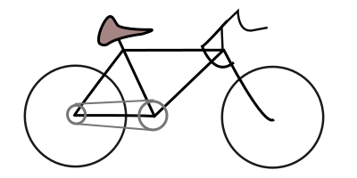

# Road Bike

<https://nl.wikipedia.org/wiki/Fiets>

<!-- Image Map Generated by http://www.image-map.net/ -->

<map name="image-map">
    <area target="" alt="achterwiel" title="achterwiel" href="#achterwiel" coords="84,131,55" shape="circle">
    <area target="" alt="voorwiel" title="voorwiel" href="#voorwiel" coords="306,132,57" shape="circle">
    <area target="" alt="zadel" title="zadel" href="#zadel" coords="111,18,172,51" shape="rect">
    <area target="" alt="stuur" title="stuur" href="#stuur" coords="225,8,299,75" shape="rect">
    <area target="" alt="trappers" title="trappers" href="#trappers" coords="172,131,16" shape="circle">
    <area target="" alt="ketting" title="ketting" href="#ketting" coords="75,113,186,145" shape="rect">
    <area target="" alt="frame" title="frame" href="#frame" coords="86,53,308,141" shape="rect">
</map>

## Achterwiel
Dit wiel duwt je voort.

## Voorwiel
Complementeert het achterwiel.

## Zadel
Je kan niet gemakkelijk staand fietsen dus dan maar zittend op een zadel.

## Stuur
Je moet je handen ergens kwijt! En je kan er ook nog mee sturen!

## Trappers
Dit is het contact punt met het achterwiel.

## Ketting
Bindt trappers en achterwiel samen.

## Frame
Die bindt alles samen!

