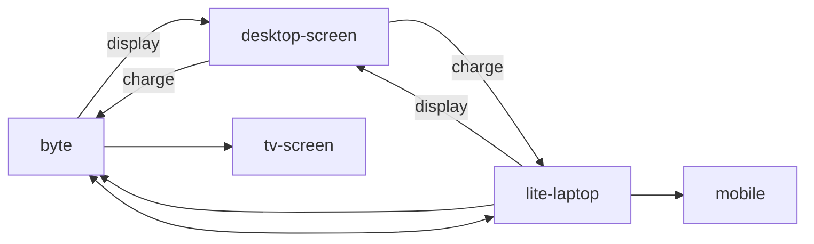

# Hardware

Allowing static components to build software on. Preferably it remeans solid and minimal as changing is expensive.

Added to the processor are input and output, which come in different forms. 

## ## Ideal computer

Tablet with keyboard mat overlay, based on pressure input.

- Micro-usb output to desktop display

- Mouse/stylus/pointer/IR/joypad input

- Smooth browsing

- WebOS

- Slow, but steady and efficient performance

- Passive cooling

- over 4 hours battery life

- Phone (small)l charger

- 720p or golden-ratio

## Laptop

[Starlabs Star Lite MK IV Review - Gadgetoid Gadgetoid](https://www.gadgetoid.com/2022/07/05/starlabs-star-lite-mk-iv-review/)

ttps://versus.com/en/intel-core-i3-7100-vs-intel-pentium-silver-n5000

- notable are Thermal Design Power
- increased clock speed
- GPU Turbo, Turbo Clock Speed

Imaginarary laptop specs

- fanless (noiseless)
- lightweight
- run lightweight games
- smooth browsing
- smooth video playing
- efficient, small impact
- reasonable battery life
- big trackpad
- repairable
- ethernet https://www.cablematters.com/pc-683-125-usb-c-to-ethernet-gigabit-lan-network-adapter-thunderbolt-3-port-compatible.aspx
- 128 GB storage + cloud/collaborative storage
- silent keyboard
- linux distro
- stereo speakers
- lightweight development/editing
- small charging cable

[Laptop Buying Guide: 8 Essential Tips | Laptop Mag](https://www.laptopmag.com/articles/laptop-buying-guide)

https://www.cablematters.com/Blog/USB-C/what-devices-use-usb-c

### Specialized computing

- discrete GPU

- Desktop screen

- TV screen.

- Realtime Games

better to share it.

> This is something that I feel we should have abandoned some time ago in 
> favor of full-pad force-clicking that uses tracking or multi-touch to 
> differentiate between the primary and secondary clicks *(left- and right-clicking seem to be obsolete terms in this context)*.
>  The isolation of the push-click to specific corners feels unfitting for
>  this premium laptop. Especially when the farther you stray from the 
> corner, the more force is required for push-clicking. - [StarBook Mk V From Star Labs Review: Can It Replace Big Names In The Segment?](https://fossbytes.com/starbook-mk-v-from-star-labs-review/)

[Review: Star Labs StarBook Mk V &#8211; Digital Incite and Matter](https://digitaliandm.com/2021/12/27/review-star-labs-starbook-mk-v/)

### Combo's

components

- lite laptop: keyboard & mouse editing, creation, connector

- mobile: transactions, consuming

- byte: computing power, console like, consuming

- tv screen: shared visuals

- desktop screen: individual visuals

- bootable USB drive

