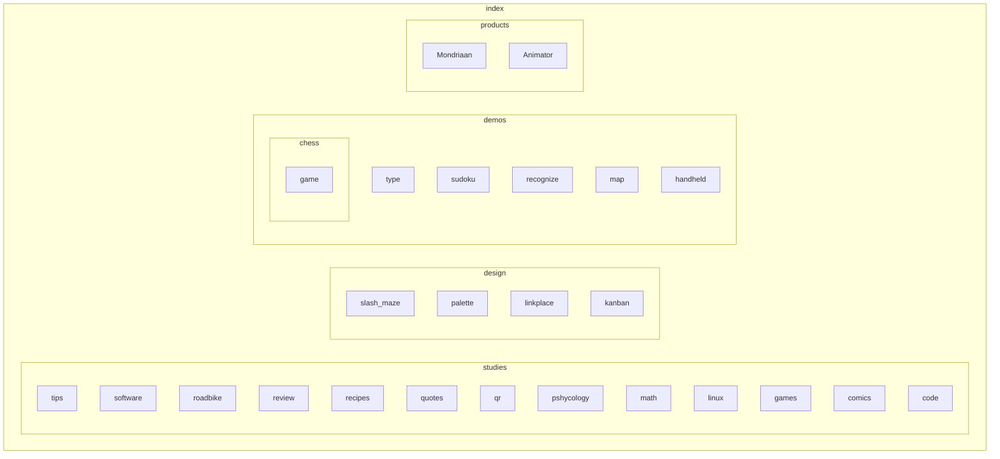

# Bou-lang specifications

Translating programming text to Graphical User Interfaces, to increase recognition and learnabilty. The difference between text and graphics is that graphics have clear boundaries where text can be more loose. So to cross this gap we use definitions.

## Definition list

...

## Sequencing

Two become one or union, this is true to the lowest level of which logic gates operate.

The only state is a trail left by incompleted computations.

Solvers:odd

Definitions: even

## Programm Image

To create an image from text we need to map the definitions to graphical representations. First we can get a definition tree containing all the names set for the definitions and their scope.

| Definition | Type      | Graphic      |
| ---------- | --------- | ------------ |
| X < Y < Z  | Range     | Slider       |
|            | Undefined | Button       |
|            | Boolean   | Checkbox     |
|            | Option    | Radio button |

### Image Interaction

Now we can have interactions with the definition through its area in the image. 

### Graphical Image Creation

We use the language that can creates an image of itself, by creating an Graphical User Interface that creates the text for that language through a visually supported interaction. This can be integrated into the generated image, by adding an`Add a Definition` Button, which inlcudes the `Branch` Definition. You would then have to choose one of the implemented defintions and configure them.

## Test

```bou
include foo, +, -, *, /, 

Pi = 355 / 113
Golden-ratio = (1 + sqr(5)) / 2
Foo = x  ( 
        Y + Z ) #implicit *
Foo2 = x + Y * Z
Foo3 = x * Y + Z
Fib = X * 1.631
Range = 0 < 100
Print(Range) # gets a random instance of the valid solutions, but can use a fixed seed for reproducibility.


Tree = A (B ( C (D , E) F ) G , H)
- A
    -B
        -C
            -D    
            -E
        -F
    -G
    -H

`=` for input and output
Parameter1 = log(controller.joystick) # input binded automatically to controller.joystick
Output.Pixel1 = Red # or just automated

Instance = Input.Load(path)

Output.new(path) # for user
Output.overwrite(path)
```



## Optimization

Memory can be tradeoff for performance by precomputing all possible values of an undefined ranged definition. This only has a cost at setup.
